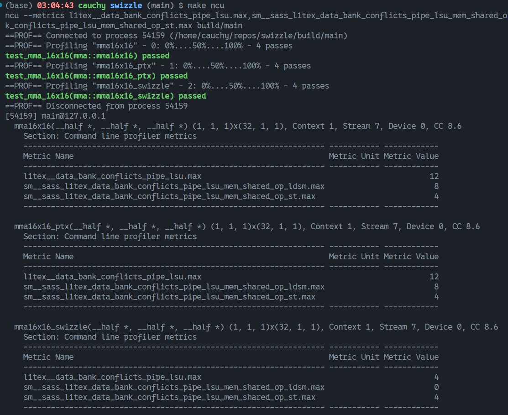

# swizzle

本仓库为 Swizzle 实验仓库，从 Tensor Core 的 MMA 相关指令出发探索了如何利用 Swizzle 高效地进行 Tensor Core 矩阵乘法。

## 成果展示

对 FP16 的 m16n16k16 Tensor Core 的使用优化如下：



算子依次为：
- 使用 `nvcuda::wmma` 的 `load_matrix_sync` 指令
- 使用与 `load_matrix_sync` 相同的加载方式，内联 PTX 执行
- 内联 PTX 并采用 Swizzle Load

## 文件说明

实验代码位于 `src/` 目录下，各文件作用如下：

- `mma.cuh`: Tensor Core 计算函数封装，含 `_swizzle` 后缀函数已实现了 LDSM conflict free
- `ptx.cuh`: PTX 内联汇编的封装
- `test.cuh`: 测试函数封装
- `utils.cuh`: 工具函数封装，包含数据填充/输出等
- `main.cu`: 测试驱动文件

## 使用说明
拉取本仓库后可直接运行如下命令运行：
```sh
mkdir build && cd build
cmake ..
make 
./main
```

使用本仓库的建议：

- 在 `main.cu` 中仅保留自己想尝试的测试，注释其他行
- 跳转至测试所用的 kernel，自由修改/打印
