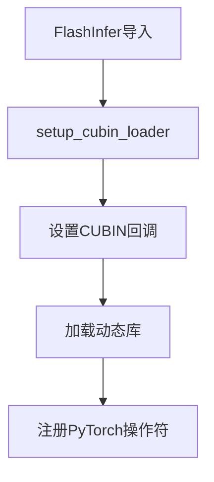
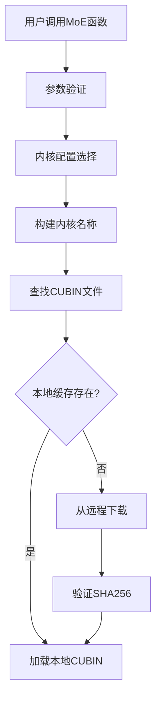
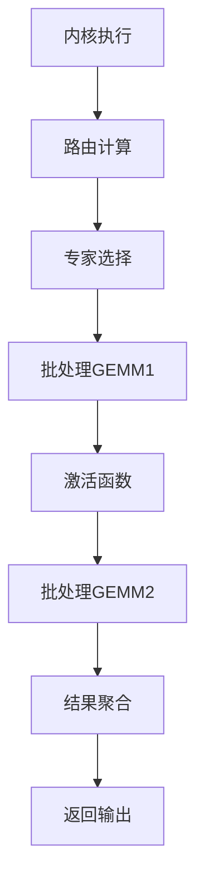

## 0x0. 前言

FlashInfer作为一个高性能的推理框架，通过优雅的集成方式将TensorRT-LLM的优化kernel无缝集成到自己的生态系统中，而不用把超大的TensorRT-LLM源码放进来。这里以MoE模块为例子分析了FlashInfer是如何集成TensorRT-LLM的源码和CUBIN文件的。实际上TensorRT-LLM还有h嗯多比较独立的kernel例如ds v3 low latency gemm相关的kernel，通信相关的kernel，这些kernel是开源的，不涉及cubin，所以插入到FlashInfer是相对简单，这里只关注没有开放源码的kernel（通过cubin放出）如何集成。

### 核心问题

- **如何在不直接依赖TensorRT-LLM源码的情况下使用其优化内核，且这些kernel依赖TensorRT-LLM Gen系统生成的cubin**
- **如何动态加载和管理大量的CUBIN文件？让当前的源码不要变得Huge**

### TensorRT-LLM Gen系统

TensorRT-LLM Gen是NVIDIA开发的代码生成系统，用于自动生成高度优化的CUDA内核：


在TensorRT-LLM的github仓库只能搜到这几个有关系的字段，并且这三个文件都是通过Gen系统生成的模板，但是具体的生成脚本没有开放，不过大概也可以猜出这几个字段的意思。

另外就是w我们可以发现使用了Gen系统的就是 Gemm，BatchGemm，和MoE的GemmGatedAct模块, 此外应该还有MHA/MLA模块。感觉这些kernel应该是TensorRT-LLM的护城河了，是高度优化过比开源性能更强的实现，最后用cubin的方式放出也可以理解。下面是Gen系统生成的模板文件中几个字段的含义：

- **版本信息**：`TLLM_GEN_EXPORT_VERSION "6.0.3.0.2.1"`
- **提交哈希**：`TLLM_GEN_COMMIT "c603ed2"`
- **配置哈希**：`TLLM_GEN_BATCHED_GEMM_CONFIG_HASH "65deb07"`


本文将以FlashInfer集成TensorRT-LLM的MoE模块为例子探索一下这个集成的技术，从流程上来说MoE 模块需要：
- 专家路由计算
- 批处理矩阵乘法
- 多种量化格式支持（FP8、E4m3、E2m1等）

## 0x1. 集成架构设计

### 整体架构

```
FlashInfer Python API
    ↓
JIT编译层 (fused_moe.py)
    ↓  
CUDA kernel启动器 (trtllm_fused_moe_kernel_launcher.cu)
    ↓
TRT-LLM kernel运行器 (trtllm_fused_moe_runner.cu)
    ↓
TRT-LLM kernel实现 (DevKernel.h, RoutingKernel.h等)
    ↓
CUBIN动态加载和执行
```

### 分层设计

我们可以从上面画的草图总结出这个集成的过程是一个分层的设计，从上到下分别是：

1. **接口层**：提供PyTorch兼容的API
2. **调度层**：管理内核选择和参数验证
3. **执行层**：协调路由和MoE内核
4. **加载层**：动态管理CUBIN文件

## 0x2. FlashInfer TRT-LLM MoE模块源码集成技术

### 0x2.1 头文件集成

FlashInfer将TensorRT-LLM的关键头文件直接复制到自己的include目录，具体包含：

```cpp
// 在trtllm_fused_moe_kernel_launcher.cu中
#include "flashinfer/trtllm/batched_gemm/trtllmGen_bmm_export/trtllm/gen/DtypeDecl.h"
#include "flashinfer/trtllm/fused_moe/DevKernel.h"
#include "flashinfer/trtllm/fused_moe/RoutingKernel.h"
#include "flashinfer/trtllm/batched_gemm/trtllmGen_bmm_export/BatchedGemmInterface.h"
```

对应的链接在：https://github.com/flashinfer-ai/flashinfer/tree/main/include/flashinfer/trtllm/fused_moe 和 https://github.com/flashinfer-ai/flashinfer/tree/main/include/flashinfer/trtllm/batched_gemm

### 0x2.2 命名空间隔离

接着，FlashInfer针对TensorRT-LLM的kernel使用独立的命名空间避免和FlashInfer自己的kernel冲突，例如csrc下面的fused moe kernel runner实现部分有`tensorrt_llm::kernels::trtllmGenFp8BlockScaleMoe `命名空间，对于cubin加载也有`trtllm_cubin_loader`命名空间。通过命名空间隔离，可以避免和FlashInfer自己的kernel冲突，同时也可以避免和TensorRT-LLM的kernel冲突。

### 0x2.3 核心源文件速览

FlashInfer集成了5个核心CUDA源文件：

| 文件 | 功能 | 作用 |
|------|------|------|
| `trtllm_fused_moe_kernel_launcher.cu` | PyTorch接口层 | 参数验证、内存管理、内核调度 |
| `trtllm_fused_moe_runner.cu` | fused moe kernel运行器 | 协调路由和MoE kernel执行 |
| `trtllm_fused_moe_routing_kernel.cu` | 路由kernel | 专家选择和负载均衡 |
| `trtllm_fused_moe_dev_kernel.cu` | 设备kernel | 底层CUDA kernel实现 |
| `trtllm_batched_gemm_runner.cu` | Batched GEMM运行器 | 矩阵乘法优化 |

## 0x3. CUBIN动态加载系统

### 0x3.1 系统架构

FlashInfer实现了创新的动态CUBIN加载系统，而不是直接包含TensorRT-LLM的cubin.cpp文件。

```cpp
// CUBIN加载器回调机制
void (*callbackGetCubin)(const char* path, const char* sha256) = nullptr;

// Python回调设置
extern "C" void FlashInferSetCubinCallback(void (*callback)(const char* path, const char* sha256));

// 获取CUBIN的API
std::string getCubin(const std::string& name, const std::string& sha256);
```

### 0x3.2 获取CUBIN文件路径的实现

以`BatchedGemmInterface.h`中的CUBIN文件构建路径为例：

```cpp
const std::string pipeline_hash = "39b7e49bfedde88ea29bfdc2547cbba659f2b236";
const std::string cubin_path = pipeline_hash + "/" + std::string("batched_gemm-") +
                               TLLM_GEN_COMMIT + "-" + TLLM_GEN_BATCHED_GEMM_CONFIG_HASH + "/";
```

CUBIN完整的路径格式为：

```
{pipeline_hash}/batched_gemm-{TLLM_GEN_COMMIT}-{TLLM_GEN_BATCHED_GEMM_CONFIG_HASH}/{kernel_name}
```

实际示例：

```
39b7e49bfedde88ea29bfdc2547cbba659f2b236/batched_gemm-c603ed2-65deb07/Bmm_Bfloat16_E2m1E2m1_Fp32_t128x16x256_et128x16_m128x16x64_cga1x1x1_16dp256b_s6_TN_transOut_schedP_bN_dynBatch_sm100a.cubin
```

这段代码对应 https://github.com/flashinfer-ai/flashinfer/blob/main/include/flashinfer/trtllm/batched_gemm/trtllmGen_bmm_export/BatchedGemmInterface.h#L642-L658 ：

```c++

#ifdef TLLM_GEN_EXPORT_INTERFACE
  CUmodule cuModule;
  CUfunction cuFunction;

  auto fiModuleLoadData = [&](CUmodule* module) {
    const std::string sha256 = config.mHash ? config.mHash : "";
    const std::string pipeline_hash = "39b7e49bfedde88ea29bfdc2547cbba659f2b236";
    const std::string cubin_path = pipeline_hash + "/" + std::string("batched_gemm-") +
                                   TLLM_GEN_COMMIT + "-" + TLLM_GEN_BATCHED_GEMM_CONFIG_HASH + "/";
    std::string fname_cubin = config.mFunctionName;
    if (!fname_cubin.empty()) {
      fname_cubin[0] = static_cast<char>(std::toupper(static_cast<unsigned char>(fname_cubin[0])));
    }
    fname_cubin = cubin_path + fname_cubin;
    std::string cubin = flashinfer::trtllm_cubin_loader::getCubin(fname_cubin, sha256);
    cuModuleLoadData(&cuModule, cubin.c_str());
  };
```

### 0x3.3 远程仓库管理

FlashInfer从NVIDIA的Artifactory仓库获取CUBIN文件：

```python
FLASHINFER_CUBINS_REPOSITORY = os.environ.get(
    "FLASHINFER_CUBINS_REPOSITORY",
    "https://edge.urm.nvidia.com/artifactory/sw-kernelinferencelibrary-public-generic-local/"
)
```

从这个cubin远程仓库的截图可以看到对应commit下有哪些cubin文件可以下载。


### 0x3.4 FlashInfer cubin 缓存机制

```python
def get_cubin(name, sha256, file_extension=".cubin"):
    cubin_fname = name + file_extension
    cubin_path = FLASHINFER_CACHE_DIR / "cubins" / cubin_fname
    
    # 1. 尝试从本地缓存加载
    cubin = load_cubin(cubin_path, sha256)
    if cubin:
        return cubin
    
    # 2. 从远程仓库下载
    uri = FLASHINFER_CUBINS_REPOSITORY + "/" + cubin_fname
    download_file(uri, cubin_path)
    return load_cubin(cubin_path, sha256)
```

## 0x4. 核心组件分析

### 0x4.1 JIT编译系统组件

#### setup_cubin_loader功能

代码见：https://github.com/flashinfer-ai/flashinfer/blob/main/flashinfer/jit/cubin_loader.py#L170

```python
def setup_cubin_loader(dll_path: str):
    _LIB = ctypes.CDLL(dll_path)
    
    def get_cubin_callback(name, sha256):
        cubin = get_cubin(name.decode("utf-8"), sha256.decode("utf-8"))
        _LIB.FlashInferSetCurrentCubin(
            convert_to_ctypes_char_p(cubin), ctypes.c_int(len(cubin))
        )
    
    cb = CALLBACK_TYPE(get_cubin_callback)
    _LIB.FlashInferSetCubinCallback(cb)
```

**功能：**

- 设置CUBIN加载回调函数
- 管理动态库加载
- 处理Python与C++的接口

#### `module.build_and_load` 功能

代码见：https://github.com/flashinfer-ai/flashinfer/blob/main/flashinfer/jit/core.py#L117-L130

```python
def build_and_load(self, class_name: str = None):
    if self.aot_path.exists():
        so_path = self.aot_path
    else:
        so_path = self.jit_library_path
        self.build(verbose)
    
    load_class = class_name is not None
    loader = torch.classes if load_class else torch.ops
    loader.load_library(so_path)
    
    if load_class:
        cls = torch._C._get_custom_class_python_wrapper(self.name, class_name)
        return cls
    return getattr(loader, self.name)
```

**功能：**
- 编译CUDA源码生成动态库
- 加载动态库到PyTorch
- 返回可调用的操作符或类

### 0x4.2 kernel 配置系统(以Batched GEMM为例)

#### 数据类型支持

代码对应：https://github.com/flashinfer-ai/flashinfer/blob/main/include/flashinfer/trtllm/batched_gemm/trtllmGen_bmm_export/trtllm/gen/DtypeDecl.h#L43

```cpp
enum class Dtype : uint32_t {
    Bfloat16, E2m1, E2m3, E3m2, E4m3, E5m2, Fp16, Fp32, 
    Int8, Int32, Int64, MxE2m1, MxE4m3, UE8m0, ...
};
```

#### kernel 命名规范

kernel 名称包含完整的配置信息，以Batched GEMM为例：
```
Bmm_{InputType}_{WeightType}_{OutputType}_t{TileSize}_et{EpilogueTile}_m{MmaTile}_cga{ClusterGridArray}_{Stages}_{Transpose}_{Schedule}_{BatchMode}_{Architecture}
```

**示例解析：**
- `Bmm_Bfloat16_E2m1E2m1_Fp32`：输入BFloat16，权重E2m1，输出FP32
- `t128x16x256`：Tile大小128x16x256
- `schedP`：并行调度策略
- `bN`：批处理N维度
- `sm100a`：SM100架构（H200/H100）

### 0x4.3 MoE kernel 实现

#### 路由kernel

代码见：https://github.com/flashinfer-ai/flashinfer/blob/main/csrc/trtllm_fused_moe_kernel_launcher.cu#L179

```cpp
tensorrt_llm::kernels::trtllmGenFp8BlockScaleMoe::Routing::Runner routing_runner(tile_tokens_dim);
routing_runner.run(
    args.routing_logits, args.routing_bias, args.num_tokens, args.num_experts, args.top_k,
    args.n_group, args.topk_group, args.local_expert_offset, args.local_num_experts,
    args.routed_scaling_factor, expert_indexes.data_ptr<int>(),
    expert_count_histogram.data_ptr<int>(), total_num_padded_tokens.data_ptr<int>(),
    // ... 其他参数
);
```

#### Batched GEMM kernel

代码见：https://github.com/flashinfer-ai/flashinfer/blob/main/include/flashinfer/trtllm/batched_gemm/trtllmGen_bmm_export/BatchedGemmInterface.h#L701

```cpp
auto result = trtllm::gen::launchKernel(
    (void*)&kernelParams, cudaStream, config.mSharedMemSize, cuFunction, block3, grid3, cluster3,
    usePdl && (config.mOptions.mGridWaitForPrimaryEarlyExit |
               config.mOptions.mGridWaitForPrimaryA | config.mOptions.mGridWaitForPrimaryB));
```

## 0x5. 工作流程详解

### 0x5.1 初始化阶段



### 0x5.2 kernel选择阶段



### 0x5.3 执行阶段



### 0x5.4 具体实现示例

#### trtllm_gen_fused_moe模块

代码见：https://github.com/flashinfer-ai/flashinfer/blob/main/flashinfer/fused_moe.py#L698-L774

```python
def trtllm_gen_fused_moe_sm100_module():
    return JitSpec(
        name="trtllm_gen_fused_moe_sm100",
        cuda_sources=[
            "trtllm_fused_moe_kernel_launcher.cu",
            "trtllm_fused_moe_runner.cu", 
            "trtllm_fused_moe_routing_kernel.cu",
            "trtllm_fused_moe_dev_kernel.cu",
            "trtllm_batched_gemm_runner.cu"
        ],
        cuda_include_dirs=[
            "include/flashinfer/trtllm/batched_gemm/trtllmGen_bmm_export",
            "include/flashinfer/trtllm/fused_moe",
            "include/flashinfer/trtllm/common",
            "include/flashinfer/trtllm/fmha",
            "csrc/nv_internal"
        ]
    )

@functools.cache
def get_trtllm_moe_sm100_module():
    module = trtllm_gen_fused_moe_sm100_module()
    moe_op = module.build_and_load()
    setup_cubin_loader(str(module.get_library_path()))

    @register_custom_op(
        "flashinfer::trtllm_fp8_per_tensor_scale_moe",
        mutates_args=(""),
    )
    def trtllm_fp8_per_tensor_scale_moe_op(
        routing_logits: torch.Tensor,
        routing_bias: torch.Tensor,
        hidden_states: torch.Tensor,
        gemm1_weights: torch.Tensor,
        output1_scales_scalar: torch.Tensor,
        output1_scales_gate_scalar: torch.Tensor,
        gemm2_weights: torch.Tensor,
        output2_scales_scalar: torch.Tensor,
        num_experts: int,
        top_k: int,
        n_group: int,
        topk_group: int,
        intermediate_size: int,
        local_expert_offset: int,
        local_num_experts: int,
        routed_scaling_factor: float,
        use_routing_scales_on_input: bool,
        tile_tokens_dim: int = 8,
        routing_method_type: int = 0,
    ) -> torch.Tensor:

        # Call the C++ function
        output = moe_op.trtllm_fp8_per_tensor_scale_moe(
            routing_logits,
            routing_bias,
            hidden_states,
            gemm1_weights,
            output1_scales_scalar,
            output1_scales_gate_scalar,
            gemm2_weights,
            output2_scales_scalar,
            num_experts,
            top_k,
            n_group,
            topk_group,
            intermediate_size,
            local_expert_offset,
            local_num_experts,
            routed_scaling_factor,
            use_routing_scales_on_input,
            tile_tokens_dim,
            routing_method_type,
        )
        return output
```

# 0x6. 总结

以上就是我对FlashInfer集成TensorRT-LLM kernel技术的分析，这种集成方式可以避免直接依赖TensorRT-LLM的源码，同时也可以动态加载和管理大量的CUBIN文件，让当前的源码在JIT编译之前不会变得很大。


