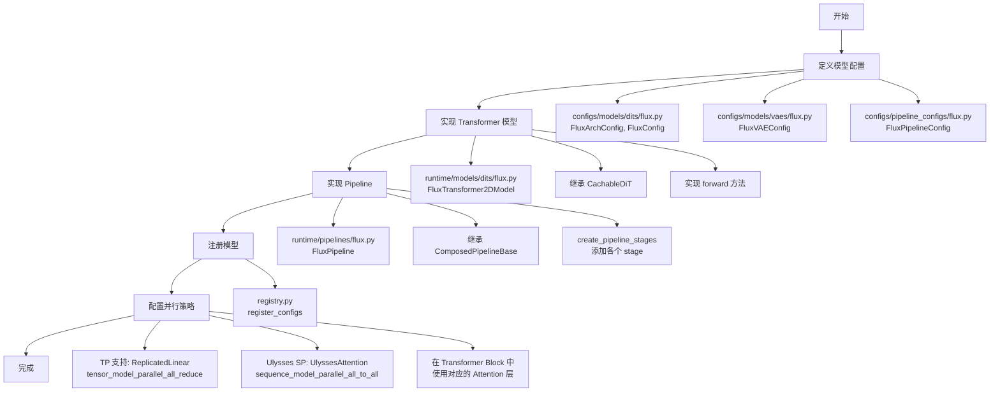

## 0x0. 前言

最近在研究 SGLang Diffusion 的源码实现，这是 SGLang 团队推出的扩散模型推理引擎，支持 Wan、Hunyuan、Qwen-Image、Flux 等主流的图像和视频生成模型。我打算以 FLUX.1-dev 为例，记录一下我对其源码实现的理解，主要包括模型搭建、并行策略和 attention backend 这几个方面。

## 0x1. 整体架构

SGLang Diffusion 是基于 SGLang 的 serving 架构来实现的，核心设计思路是 `ComposedPipelineBase` 和 `PipelineStage` 的组合模式（代码在 `python/sglang/multimodal_gen/runtime/pipelines_core/composed_pipeline_base.py` 和 `stages/base.py`）。每个 stage 封装一个特定的功能，比如文本编码、去噪、VAE 解码等，通过组合这些 stage 就可以构建完整的推理流程了。

一个典型的 pipeline 会包含这些 stage：InputValidationStage（输入验证）、TextEncodingStage（文本编码）、ConditioningStage（条件准备）、TimestepPreparationStage（时间步准备）、LatentPreparationStage（latent 准备）、DenoisingStage（去噪循环）、DecodingStage（VAE 解码）。这种模块化的设计让添加新模型或者修改现有 pipeline 都变得比较简单。

## 0x2. FLUX.1-dev 模型实现详解

接下来我以 FLUX.1-dev 为例，看看 SGLang Diffusion 是怎么搭建和运行模型的。

### 2.1 Pipeline 配置

FLUX.1-dev 的 pipeline 配置定义在 `FluxPipelineConfig` 中（`configs/pipeline_configs/flux.py`）：

```python
@dataclass
class FluxPipelineConfig(ImagePipelineConfig):
    """Configuration for the FLUX pipeline."""
    
    embedded_cfg_scale: float = 3.5
    task_type: ModelTaskType = ModelTaskType.T2I
    
    # DiT 配置
    dit_config: DiTConfig = field(default_factory=FluxConfig)
    
    # VAE 配置
    vae_config: VAEConfig = field(default_factory=FluxVAEConfig)
    
    # Text encoder 配置（CLIP + T5）
    text_encoder_configs: tuple[EncoderConfig, ...] = field(
        default_factory=lambda: (CLIPTextConfig(), T5Config())
    )
```

这个配置定义了 FLUX.1-dev 需要的所有组件：DiT（核心扩散模型）、VAE（图像编解码）、Text Encoders（CLIP 和 T5 两个文本编码器）。

### 2.2 模型架构

FLUX.1-dev 的 transformer 架构在 `FluxTransformer2DModel` 中实现（`runtime/models/dits/flux.py`）：

```python
class FluxTransformer2DModel(CachableDiT):
    def __init__(self, config: FluxConfig, hf_config: dict[str, Any]) -> None:
        super().__init__(config=config, hf_config=hf_config)
        
        # 核心组件
        self.rotary_emb = FluxPosEmbed(theta=10000, axes_dim=self.config.axes_dims_rope)
        self.time_text_embed = CombinedTimestepTextProjEmbeddings(...)
        self.context_embedder = ReplicatedLinear(...)
        self.x_embedder = ReplicatedLinear(...)
        
        # Transformer blocks（双流架构）
        self.transformer_blocks = nn.ModuleList([
            FluxTransformerBlock(...) for _ in range(self.config.num_layers)
        ])
        
        # Single transformer blocks
        self.single_transformer_blocks = nn.ModuleList([
            FluxSingleTransformerBlock(...) for _ in range(self.config.num_single_layers)
        ])
```

FLUX 采用了独特的双流架构：transformer_blocks 处理图像和文本的联合 attention（19层），single_transformer_blocks 只处理图像的 attention（38层）。这个设计还是挺有意思的。

### 2.3 Pipeline Stages 详解

FLUX.1-dev 的 pipeline 由以下 stages 组成（完整代码在 `runtime/pipelines/flux.py` 的 `create_pipeline_stages` 方法）：

```python
def create_pipeline_stages(self, server_args: ServerArgs):
    # 1. 输入验证
    self.add_stage(
        stage_name="input_validation_stage", 
        stage=InputValidationStage()
    )
    
    # 2. 文本编码（CLIP + T5）
    self.add_stage(
        stage_name="prompt_encoding_stage_primary",
        stage=TextEncodingStage(
            text_encoders=[
                self.get_module("text_encoder"),      # CLIP
                self.get_module("text_encoder_2"),    # T5
            ],
            tokenizers=[
                self.get_module("tokenizer"),
                self.get_module("tokenizer_2"),
            ],
        ),
    )
    
    # 3. 条件准备
    self.add_stage(
        stage_name="conditioning_stage", 
        stage=ConditioningStage()
    )
    
    # 4. 时间步准备
    self.add_stage(
        stage_name="timestep_preparation_stage",
        stage=TimestepPreparationStage(
            scheduler=self.get_module("scheduler"),
            prepare_extra_set_timesteps_kwargs=[prepare_mu],
        ),
    )
    
    # 5. Latent 准备
    self.add_stage(
        stage_name="latent_preparation_stage",
        stage=LatentPreparationStage(
            scheduler=self.get_module("scheduler"),
            transformer=self.get_module("transformer"),
        ),
    )
    
    # 6. 去噪循环
    self.add_stage(
        stage_name="denoising_stage",
        stage=DenoisingStage(
            transformer=self.get_module("transformer"),
            scheduler=self.get_module("scheduler"),
        ),
    )
    
    # 7. VAE 解码
    self.add_stage(
        stage_name="decoding_stage", 
        stage=DecodingStage(vae=self.get_module("vae"))
    )
```

`TextEncodingStage`（`pipelines_core/stages/text_encoding.py`）负责将文本 prompt 编码成 embedding：

```python
class TextEncodingStage(PipelineStage):
    def forward(self, batch: Req, server_args: ServerArgs) -> Req:
        # 使用 CLIP 和 T5 编码 prompt
        prompt_embeds_list, prompt_masks_list, pooler_embeds_list = self.encode_text(
            prompt_text,
            server_args,
            encoder_index=all_indices,
            return_attention_mask=True,
        )
        
        # 如果启用 CFG，也编码 negative prompt
        if batch.do_classifier_free_guidance:
            neg_embeds_list, neg_masks_list, neg_pooler_embeds_list = self.encode_text(
                batch.negative_prompt,
                server_args,
                encoder_index=all_indices,
                return_attention_mask=True,
            )
```

FLUX 使用两个文本编码器：CLIP 提供 pooled embeddings 用于全局条件，T5 提供序列 embeddings 用于细粒度文本理解。

`DenoisingStage`（`pipelines_core/stages/denoising.py`）是最核心的 stage，执行迭代去噪：

```python
class DenoisingStage(PipelineStage):
    def forward(self, batch: Req, server_args: ServerArgs) -> Req:
        # 初始化 latents
        latents = batch.latents
        
        # 迭代去噪
        for i, t in enumerate(timesteps):
            # 准备输入
            latent_model_input = self.scheduler.scale_model_input(latents, t)
            
            # Transformer 前向传播
            noise_pred = self.transformer(
                hidden_states=latent_model_input,
                encoder_hidden_states=prompt_embeds,
                pooled_projections=pooled_embeds,
                timestep=t,
                freqs_cis=freqs_cis,
            )
            
            # 更新 latents
            latents = self.scheduler.step(noise_pred, t, latents)
```

### 2.4 模型加载流程

SGLang Diffusion 使用 `PipelineComponentLoader` 来加载各个组件（`runtime/loader/component_loader.py`），具体的加载逻辑在 `ComposedPipelineBase` 的 `load_modules` 方法中：

```python
def load_modules(self, server_args: ServerArgs) -> dict[str, Any]:
    model_index = self._load_config()  # 读取 model_index.json
    
    components = {}
    for module_name, (transformers_or_diffusers, architecture) in model_index.items():
        if module_name not in required_modules:
            continue
            
        # 加载模块
        module = PipelineComponentLoader.load_module(
            module_name=module_name,
            component_model_path=component_model_path,
            transformers_or_diffusers=transformers_or_diffusers,
            server_args=server_args,
        )
        components[module_name] = module
    
    return components
```

加载过程比较清晰：读取 `model_index.json` 获取组件信息，根据配置加载每个组件（transformer, vae, text_encoder 等），应用 TP/SP 等并行策略，最后返回组件字典供 pipeline 使用。

## 0x3. 并行策略详解

接下来聊聊 SGLang Diffusion 的并行策略，这块是它高性能的关键。它支持多种并行方式，我一个个来看。

### 3.1 Tensor Parallelism (TP)

TP 就是把模型的参数按张量维度切分到多个 GPU 上。在 FLUX 中，主要应用在 `ReplicatedLinear` 这个线性层（`runtime/layers/linear.py`）：

```python
class ReplicatedLinear(nn.Module):
    """支持 TP 的线性层"""
    def forward(self, x):
        # 在 TP 模式下，权重被切分
        output = F.linear(x, self.weight, self.bias)
        # All-reduce 聚合结果
        if self.tp_size > 1:
            output = tensor_model_parallel_all_reduce(output)
        return output
```

TP 的好处是可以减少单卡显存占用、增加计算并行度，对大模型推理很有帮助。

### 3.2 Ulysses Sequence Parallelism

Ulysses SP 是一种序列并行方法，通过 all-to-all 通信在序列和头维度之间进行切分（`UlyssesAttention` 的实现在 `runtime/layers/attention/layer.py`）：

```python
class UlyssesAttention(nn.Module):
    def forward(self, q, k, v):
        # 输入: [B, S_local, H, D]
        
        # Stack QKV
        qkv = torch.cat([q, k, v], dim=0)
        
        # All-to-all: 在头和序列维度之间重分布
        # [3*B, S_local, H, D] -> [3*B, S_global, H_local, D]
        qkv = sequence_model_parallel_all_to_all_4D(
            qkv, scatter_dim=2, gather_dim=1
        )
        
        # 执行 attention
        output = self.attn_impl.forward(q, k, v, ctx_attn_metadata)
        
        # All-to-all: 恢复原始分布
        # [B, S_global, H_local, D] -> [B, S_local, H, D]
        output = sequence_model_parallel_all_to_all_4D(
            output, scatter_dim=1, gather_dim=2
        )
        
        return output
```

Ulysses SP 的工作原理是这样的：输入阶段每个 GPU 持有完整序列的一部分和完整的头，通过 all-to-all 通信将序列维度 gather、头维度 scatter，然后每个 GPU 计算完整序列的部分头，最后再通过 all-to-all 通信恢复原始分布。

### 3.3 USP (Unified Sequence Parallelism)

USP 把 Ulysses SP 和 Ring Attention 结合起来了（`USPAttention` 的实现也在 `runtime/layers/attention/layer.py`）：

```python
class USPAttention(nn.Module):
    def forward(self, q, k, v):
        # Ulysses-style All-to-All
        if get_ulysses_parallel_world_size() > 1:
            q = _usp_input_all_to_all(q, head_dim=2)
            k = _usp_input_all_to_all(k, head_dim=2)
            v = _usp_input_all_to_all(v, head_dim=2)
        
        # Ring Attention（如果启用）
        if get_ring_parallel_world_size() > 1:
            out = ring_attn(q, k, v, attn_impl=self.attn_impl)
        else:
            out = self.attn_impl.forward(q, k, v, ctx_attn_metadata)
        
        # Ulysses-style All-to-All（恢复）
        if get_ulysses_parallel_world_size() > 1:
            out = _usp_output_all_to_all(out, head_dim=2)
        
        return out
```

USP 把 Ulysses 和 Ring 的优点结合起来了，并行配置更灵活，对超长序列特别有用。

### 3.4 CFG Parallelism

Classifier-Free Guidance (CFG) 并行是把正负条件的计算分配到不同 GPU 上：

```python
# 在 DenoisingStage 中
if batch.do_classifier_free_guidance:
    # CFG rank 0 计算正条件
    # CFG rank 1 计算负条件
    cfg_rank = get_classifier_free_guidance_rank()
    
    if cfg_rank == 0:
        noise_pred = transformer(latents, pos_prompt_embeds, ...)
    else:
        noise_pred = transformer(latents, neg_prompt_embeds, ...)
    
    # All-gather 收集结果
    noise_pred = cfg_model_parallel_all_gather(noise_pred, dim=0)
    
    # 组合预测
    noise_pred_uncond, noise_pred_text = noise_pred.chunk(2)
    noise_pred = noise_pred_uncond + guidance_scale * (noise_pred_text - noise_pred_uncond)
```

### 3.5 并行组件在模型中的使用

这些并行组件在不同模型中的使用方式基本一致，我以几个典型模型为例说明。

**FLUX 模型中的使用**（`runtime/models/dits/flux.py`）：

```python
class FluxAttention(nn.Module):
    def __init__(self, query_dim, num_heads, ...):
        # TP 支持：使用 ReplicatedLinear
        self.to_q = ReplicatedLinear(query_dim, self.inner_dim, bias=bias)
        self.to_k = ReplicatedLinear(query_dim, self.inner_dim, bias=bias)
        self.to_v = ReplicatedLinear(query_dim, self.inner_dim, bias=bias)
        
        # 输出投影也用 ReplicatedLinear
        self.to_out = torch.nn.ModuleList([])
        self.to_out.append(
            ReplicatedLinear(self.inner_dim, self.out_dim, bias=out_bias)
        )
        
        # 使用 USPAttention 支持序列并行
        self.attn = USPAttention(
            num_heads=num_heads,
            head_size=self.head_dim,
            causal=False,
            supported_attention_backends={
                AttentionBackendEnum.FA,
                AttentionBackendEnum.TORCH_SDPA,
            },
        )
```

FLUX 的所有线性层都用 `ReplicatedLinear` 替换了标准的 `nn.Linear`，这样在启用 TP 时权重会自动切分。Attention 层使用 `USPAttention`，可以同时支持 Ulysses 和 Ring 并行。

**HunyuanVideo 模型中的使用**（`runtime/models/dits/hunyuanvideo.py`）：

```python
class MMDoubleStreamBlock(nn.Module):
    def __init__(self, hidden_size, num_attention_heads, ...):
        # QKV 投影使用 ReplicatedLinear
        self.img_attn_qkv = ReplicatedLinear(
            hidden_size, hidden_size * 3, bias=qkv_bias
        )
        self.txt_attn_qkv = ReplicatedLinear(
            hidden_size, hidden_size * 3, bias=qkv_bias
        )
        
        # 使用 UlyssesAttention
        self.attn = UlyssesAttention(
            num_heads=num_attention_heads,
            head_size=head_dim,
            causal=False,
            supported_attention_backends=supported_attention_backends,
        )
```

HunyuanVideo 使用的是 `UlyssesAttention` 而不是 `USPAttention`，因为它不需要 Ring Attention。这个选择取决于模型的序列长度和并行需求。

**WanVideo 模型中的使用**（`runtime/models/dits/wanvideo.py`）：

```python
class WanVideoSelfAttentionBlock(nn.Module):
    def __init__(self, dim, num_heads, ...):
        # QKV 投影
        self.to_q = ReplicatedLinear(dim, dim, bias=True)
        self.to_k = ReplicatedLinear(dim, dim, bias=True)
        self.to_v = ReplicatedLinear(dim, dim, bias=True)
        
        # 使用特殊的 UlyssesAttention_VSA（Video Sparse Attention）
        self.attn1 = UlyssesAttention_VSA(
            num_heads=num_heads,
            head_size=dim // num_heads,
            causal=False,
            supported_attention_backends={
                AttentionBackendEnum.VIDEO_SPARSE_ATTN,
            },
        )
```

WanVideo 使用了特殊的 `UlyssesAttention_VSA`，这是针对视频生成优化的稀疏 attention 变体。

从这些例子可以看出，SGLang Diffusion 的并行组件使用很统一：
- 所有线性层用 `ReplicatedLinear` 替换，自动支持 TP
- Attention 层根据需求选择 `UlyssesAttention`、`USPAttention` 或特殊变体
- 不需要修改前向传播逻辑，并行通信在组件内部自动处理

### 3.6 并行策略配置

这些并行策略都可以通过命令行参数来配置：

```bash
# TP=2, Ulysses=2
sglang serve --model-path FLUX.1-dev \
    --tp-size 2 \
    --ulysses-degree 2 \
    --num-gpus 4

# USP: Ulysses=2, Ring=2
sglang serve --model-path FLUX.1-dev \
    --ulysses-degree 2 \
    --ring-degree 2 \
    --num-gpus 4

# CFG Parallel
sglang serve --model-path FLUX.1-dev \
    --enable-cfg-parallel \
    --num-gpus 2
```

## 0x4. Attention Backend 详解

SGLang Diffusion 支持多种 attention backend，可以根据硬件和场景选择最优的实现。

### 4.1 Backend 选择机制

Backend 选择逻辑在 `runtime/layers/attention/selector.py` 中：

```python
def get_attn_backend(head_size: int, dtype: torch.dtype, 
                     supported_attention_backends: set[AttentionBackendEnum]) -> AttentionBackend:
    # 根据平台和硬件选择 backend
    backend_cls_str = current_platform.get_attn_backend_cls_str(
        selected_backend, head_size, dtype
    )
    
    # 动态导入 backend 类
    backend_cls = import_from_string(backend_cls_str)
    return backend_cls()
```

### 4.2 FlashAttention Backend

默认使用的是 FlashAttention 这个高性能 attention 实现（`runtime/layers/attention/backends/flash_attn.py`）：

```python
class FlashAttentionImpl(AttentionImpl):
    def forward(self, query, key, value, attn_metadata=None):
        output = flash_attn_func(
            q=query,
            k=key,
            v=value,
            cu_seqlens_q=None,
            cu_seqlens_k=None,
            max_seqlen_q=query.shape[1],
            max_seqlen_k=key.shape[1],
            softmax_scale=self.softmax_scale,
            causal=self.causal,
            ver=fa_ver,  # FA3 for Hopper, FA4 for Blackwell
        )
        return output
```

FlashAttention 使用的是 sgl-kernel 的优化实现，支持 FA3（Hopper）和 FA4（Blackwell），内存效率高速度也快。

### 4.3 其他 Backend

除了 FlashAttention，SGLang Diffusion 还支持其他几种 backend：Torch SDPA（PyTorch 原生实现，兼容性好）、Sage Attention（针对长序列优化）、Sliding Tile Attention（适合视频生成）、Video Sparse Attention（稀疏 attention，减少计算量）、VMOBA Attention（视频 MoBA attention）。

Backend 选择逻辑：

```python
# CUDA 平台
if selected_backend == AttentionBackendEnum.FA:
    if is_blackwell():
        set_fa_ver(4)  # 使用 FA4
    else:
        set_fa_ver(3)  # 使用 FA3
    return FlashAttentionBackend
elif selected_backend == AttentionBackendEnum.SAGE_ATTN:
    return SageAttentionBackend
# ... 其他 backend
```

### 4.4 Backend 配置

可以通过环境变量来选择 backend：

```bash
# 使用 FlashAttention
export SGLANG_DIFFUSION_ATTENTION_BACKEND=fa

# 使用 Sage Attention
export SGLANG_DIFFUSION_ATTENTION_BACKEND=sage_attn

# 使用 Torch SDPA
export SGLANG_DIFFUSION_ATTENTION_BACKEND=torch_sdpa
```

## 0x5. 添加新模型支持流程

我整理了一下添加新模型的流程，以 FLUX.1-dev 为例：



具体来说分这几步：

1. 定义模型配置
   - `configs/models/dits/flux.py`: 定义 `FluxArchConfig` 和 `FluxConfig`，包含模型架构参数
   - `configs/models/vaes/flux.py`: 定义 VAE 配置
   - `configs/pipeline_configs/flux.py`: 定义 `FluxPipelineConfig`，指定 DiT、VAE、Text Encoder 等组件

2. 实现 Transformer 模型
   - `runtime/models/dits/flux.py`: 实现 `FluxTransformer2DModel`，继承 `CachableDiT`
   - 在 `__init__` 中初始化各层（embedding、transformer blocks 等）
   - 实现 `forward` 方法，定义前向传播逻辑

3. 实现 Pipeline
   - `runtime/pipelines/flux.py`: 实现 `FluxPipeline`，继承 `ComposedPipelineBase`
   - 在 `create_pipeline_stages` 中添加各个 stage（TextEncodingStage、DenoisingStage 等）
   - 每个 stage 通过 `self.get_module()` 获取对应的组件

4. 注册模型
   - `registry.py`: 调用 `register_configs` 将模型路径与配置类关联

5. 配置并行策略
   - TP 支持：在线性层中使用 `ReplicatedLinear`，在前向传播后调用 `tensor_model_parallel_all_reduce`
   - Ulysses SP 支持：在 Transformer Block 的 attention 层使用 `UlyssesAttention` 或 `USPAttention`
   - 在模型初始化时根据 `server_args.tp_size`、`server_args.ulysses_degree` 等参数配置并行

## 0x6. Profiler 使用

SGLang Diffusion 提供了两种性能分析工具：轻量级的性能日志和详细的 torch profiler。我分别介绍一下。

### 6.1 性能日志（Performance Logger）

性能日志（`runtime/utils/perf_logger.py`）可以记录每个 stage 和 denoising step 的耗时：

```bash
# 设置性能日志目录
export SGLANG_PERF_LOG_DIR=/path/to/logs

# 启动服务
sglang serve --model-path black-forest-labs/FLUX.1-dev --port 3000
```

性能日志会自动记录到 `SGLANG_PERF_LOG_DIR` 目录，包含每个 stage 的耗时（TextEncodingStage、DenoisingStage 等）、每个 denoising step 的耗时、总推理时间、Git commit hash 和时间戳。

日志格式为 JSON，可以使用脚本分析：

```python
import json

with open('perf_log.json') as f:
    data = json.load(f)
    
print(f"Total duration: {data['total_duration_ms']:.2f}ms")
for stage, duration in data['stages'].items():
    print(f"{stage}: {duration:.2f}ms")
```

### 6.2 Torch Profiler

如果需要更详细的性能分析，可以用 torch profiler（实现在 `DenoisingStage` 的 `start_profile`/`stop_profile` 方法中）。torch profiler 可以记录 CPU 和 GPU 的详细执行信息，包括算子耗时、内存使用、kernel 调用等。

启用 torch profiler 的方式很简单，直接在 `sglang generate` 命令中加 `--profile` 参数就行：

```bash
# 使用 --profile 启用 profiler
sglang generate --model-path black-forest-labs/FLUX.1-dev \
    --prompt "A cute baby sea otter" \
    --profile \
    --num-profiled-timesteps 8  # 可选：指定记录前 8 个 denoising step
```

Profiler 配置参数：

```python
# 在 DenoisingStage 中的配置
self.profiler = torch.profiler.profile(
    activities=[
        torch.profiler.ProfilerActivity.CPU,
        torch.profiler.ProfilerActivity.CUDA,  # 如果 CUDA 可用
    ],
    schedule=torch.profiler.schedule(
        skip_first=0,  # 不跳过任何步骤
        wait=0,        # 不等待
        warmup=1,      # 预热 1 步
        active=batch.num_profiled_timesteps,  # 记录指定数量的步骤
        repeat=5,      # 重复 5 次
    ),
    record_shapes=True,   # 记录张量形状
    with_stack=True,      # 记录调用栈
)
```

Profiler 输出：

生成的 trace 文件保存在 `./logs` 目录下，格式为 `{request_id}-rank{rank}.trace.json.gz`。可以使用 Chrome 的 `chrome://tracing` 或 TensorBoard 查看：

```bash
# 使用 TensorBoard 查看
tensorboard --logdir=./logs

# 或者直接在 Chrome 中打开 trace 文件
# 访问 chrome://tracing，然后加载 .trace.json.gz 文件
```

Profiler 的好处是可以看到每个 CUDA kernel 的执行时间，分析 CPU 和 GPU 之间的同步开销，识别性能瓶颈（比如内存拷贝、kernel 启动开销等），而且支持多卡分析，每个 rank 生成独立的 trace 文件。

不过要注意几点：Profiler 会增加一定的运行时开销，生产环境不建议开；对于大模型，建议只 profile 少量 timesteps（比如 3-8 步）避免内存溢出；如果遇到 OOM，可以设置 `record_shapes=False` 和 `with_stack=False` 来减少内存占用。

## 0x7. 使用示例

### 7.1 安装

```bash
# 使用 pip 安装
pip install 'sglang[diffusion]' --prerelease=allow

# 或从源码安装
git clone https://github.com/sgl-project/sglang.git
cd sglang
pip install -e "python[diffusion]" --prerelease=allow
```

### 7.2 启动服务

```bash
# 单卡推理
sglang serve --model-path black-forest-labs/FLUX.1-dev --port 3000

# 多卡 TP
sglang serve --model-path black-forest-labs/FLUX.1-dev \
    --tp-size 2 --num-gpus 2 --port 3000

# Ulysses SP
sglang serve --model-path black-forest-labs/FLUX.1-dev \
    --ulysses-degree 2 --num-gpus 2 --port 3000
```

### 7.3 调用 API

```python
import requests
import base64
from PIL import Image
from io import BytesIO

# 发送请求
response = requests.post(
    "http://127.0.0.1:3000/v1/images/generations",
    headers={"Content-Type": "application/json"},
    json={
        "model": "black-forest-labs/FLUX.1-dev",
        "prompt": "A cute baby sea otter",
        "n": 1,
        "size": "1024x1024",
        "response_format": "b64_json"
    }
)

# 解码图片
result = response.json()
image_data = base64.b64decode(result["data"][0]["b64_json"])
image = Image.open(BytesIO(image_data))
image.save("output.png")
```

### 7.4 命令行生成

```bash
# 直接生成图片
sglang generate --model-path black-forest-labs/FLUX.1-dev \
    --prompt "A Logo With Bold Large Text: SGL Diffusion" \
    --save-output
```

## 0x8. 总结

这篇文章记录了我对 SGLang Diffusion 源码的一些理解。SGLang Diffusion 通过 ComposedPipelineBase + PipelineStage 的模块化设计，提供了一个比较灵活的扩散模型推理框架。它支持丰富的并行策略（TP、Ulysses SP、USP、CFG Parallel）和多种 Attention Backend（FlashAttention、Sage Attention 等），可以高效地部署各类扩散模型。添加新模型的流程也比较清晰，只需要实现配置类、Transformer 模型、Pipeline 类并注册就行，通过 ReplicatedLinear 和 UlyssesAttention 等组件可以轻松支持并行。总的来说，SGLang Diffusion 的设计还是挺优雅的，性能也不错。

## 参考资料

- SGLang Diffusion 官方博客: https://lmsys.org/blog/2025-11-07-sglang-diffusion/
- SGLang GitHub: https://github.com/sgl-project/sglang
- FastVideo: https://github.com/hao-ai-lab/FastVideo
- FLUX.1 模型: https://huggingface.co/black-forest-labs/FLUX.1-dev