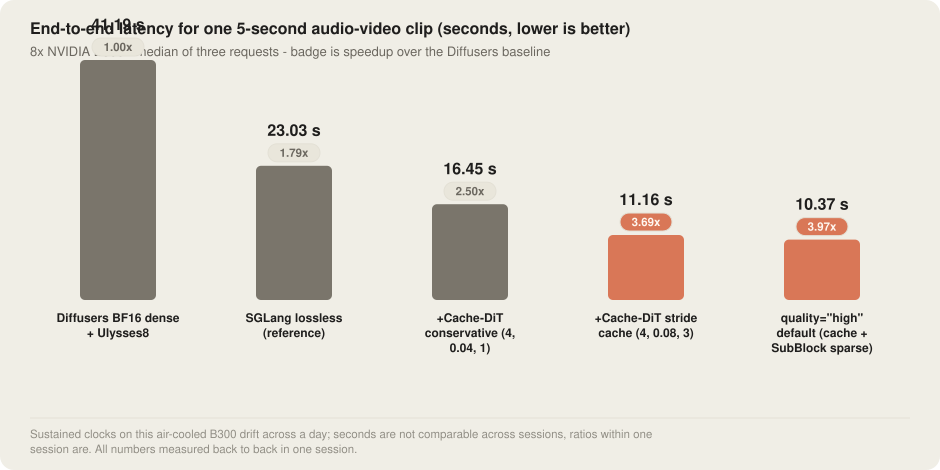
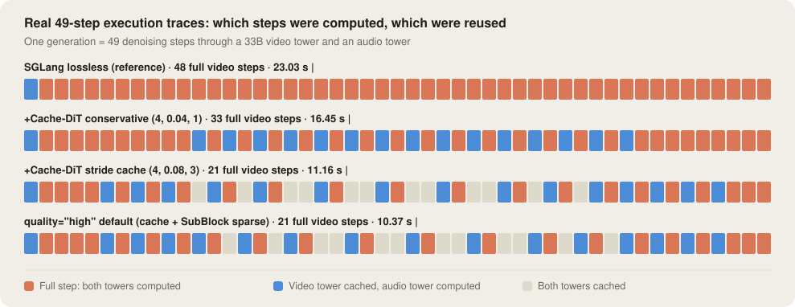
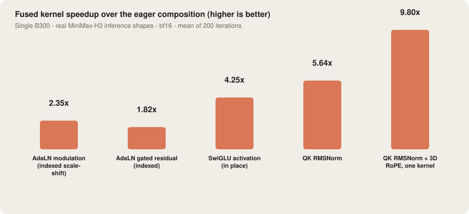

# MiniMax-H3, nearly 4× faster

> **SGLang Diffusion · MiniMax-H3 · 8× NVIDIA B300**

No distillation, no solver swap, no changes to the model. One `quality="high"` switch takes a 5-second clip from 41.19 s to 10.37 s (3.97×), with every arm cleared by frame-by-frame human review — and the cache path reproducing byte for byte.

| | |
|---|---|
| **Hardware** | 8× NVIDIA B300 SXM6 (SM103) |
| **Workload** | T2VA · 1344×768 · 124 frames · 50 steps |
| **Parallelism** | TP1 · Ulysses 8 |
| **Model** | Original weights · no distillation · no model surgery |
| **Measured** | 2026-08-15 |

---

## 0x0 · The argument

MiniMax-H3 is a 33B dual-tower DiT that emits 1344×768 video and 32 kHz stereo audio from a single forward pass. For a 5-second clip, the Diffusers baseline takes 41.19 s on 8×B300. The usual community recipes for making this faster — distillation, a different solver, surgery on the architecture — all touch the model itself, and once you do that the quality accounting gets hard. My claim is simple: leave the weights and the math alone, be rigorous about *computing less*, and that alone gets you under 11 seconds.

This post is about what SGLang Diffusion actually does on this model. Moving to the lossless path is worth 1.79× by itself. The `quality="high"` default profile on B300 — Cache-DiT stride caching at (4, 0.08, 3) plus SubBlock sparse attention — is **3.97×** in total. Every profile was cleared by continuous-frame human review, and the cache path is deterministic: byte-identical output across independent server launches.

---

## 0x1 · Results

Results first. Each bar adds exactly one technique on top of the one before it. Every configuration got one full-resolution warmup, then the median of three timed requests. The two orange bars are what this post delivers: stride caching alone, then stride caching plus sparse attention, which together are the default profile.

> This air-cooled B300 sits against an 1100 W power wall under sustained load, and its sustained clocks drift over the course of a day (around 20% in step time). Seconds are not comparable across sessions; ratios within one session are. Every number here was measured back to back in the same session.

Read down the table two ways. Against Diffusers, the default profile is 3.97×. Against SGLang's own bit-exact path — which is the honest denominator if you already run SGLang — it is 2.22×, and the conservative profile that ships today is 1.40×.

| Configuration | Latency | vs Diffusers | vs SGLang lossless |
|---|---:|---:|---:|
| Diffusers BF16 dense + Ulysses8 | 41.19 s | 1.00× | 0.56× |
| SGLang lossless (reference) | 23.03 s | 1.79× | 1.00× |
| +Cache-DiT conservative (4, 0.04, 1) | 16.45 s | 2.50× | 1.40× |
| **+Cache-DiT stride cache (4, 0.08, 3)** | **11.16 s** | **3.69×** | **2.06×** |
| **quality="high" default (cache + SubBlock sparse)** | **10.37 s** | **3.97×** | **2.22×** |

Server-side inference time, three prompts at seeds 0/1/2. The cache path is deterministic — its output is byte-identical across independent server launches.

---

## 0x2 · Where the speedup comes from

One generation runs 49 denoising steps, and every step goes through two DiT towers (the 33B video tower and an audio tower). The default profile stacks two things. The first is Cache-DiT stride caching, which skips whole steps: each step uses the first transformer block as a probe, and if the residual barely moved, the previous step's result is reused. The schedule is a triple of (warmup steps, residual threshold, max consecutive cached steps). The profile audited on 4×H200 is (4, 0.04, 1); B300 is different hardware with a different bottleneck, so we re-audited it against the same quality gates and landed on (4, 0.08, 3). That 0.08 threshold sleeps most of the time and forces a recompute the moment the trajectory drifts, leaving 21 full steps out of 49; the conservative 0.04 is sensitive enough to fire 33 times on the same prompt, which is why it is slower. The second thing is SubBlock sparse attention, which lets the steps that do get computed look at only the important KV blocks — about a quarter of them, with the first 10 steps kept dense — taking a full step from 418 ms down to 221 ms.

The strips below are the real 49-step execution traces for each profile. You can see exactly which steps were computed and which were skipped:

---

## 0x3 · The kernel layer: what was already there, and what we added

Caching decides how many steps run; kernels decide how fast each one is. For the non-GEMM part of the H3 forward pass, SGLang Diffusion already ships a few model-specific kernels. The principle is always the same: less memory traffic, fewer allocations, fewer launches. H3 packs video and audio tokens into one sequence, so AdaLN modulation and gating look their parameters up by token index and write back in place in a single pass, which removes the large intermediate tensor that `index_select` would have materialized. QK RMSNorm and 3D RoPE are merged into one kernel instead of a dozen small eager ops reading and writing the same data. SwiGLU runs in place directly on the fused gate_up buffer. The table below was measured on this B300 at the real per-GPU inference shapes for 1344×768×124 frames (bf16, mean of 200 iterations); the baseline is the eager composition that runs when these kernels are not installed:

| Operator | Eager composition | SGLang kernel | Speedup |
|---|---:|---:|---:|
| AdaLN modulation (indexed scale-shift) | 120.9 μs | 51.4 μs | 2.35× |
| AdaLN gated residual (indexed) | 78.2 μs | 43.1 μs | 1.82× |
| SwiGLU activation (in place) | 489.6 μs | 115.2 μs | 4.25× |
| QK RMSNorm | 468.7 μs | 83.1 μs | 5.64× |
| QK RMSNorm + 3D RoPE, one kernel | 1320.5 μs | 134.7 μs | 9.80× |

The SwiGLU row first measured as a wash, and the cause turned out to be the benchmark itself: an in-place operator iterating on the same buffer collapsed 86% of its values below 1e-30, and the exact fp32 `expf` fell into the denormal slow path. Feed it fresh inputs — which is what the model does, since every step consumes a new GEMM output — and it is 4.25×. The real pre-attention path takes the single kernel on the last row; the standalone QK RMSNorm row is the intermediate rung. All of these fusions are already active in the lossless baseline, so the 23.03 s bar in the ladder above was measured with them on.

Two kernel-level blockers also had to be fixed this time, both inside FlashInfer's SubBlock blk64 sparse kernel. The first one is deterministic: the kernel hangs on the first launch on B300 (SM103), because the CLC persistent scheduler dispatches into the wrong path on this architecture, the workers never receive a scheduling response, and the whole CTA spins in place. The fix statically dispatches on `__CUDA_ARCH__ == 1030` to a non-persistent one-CTA-one-tile scheduler, with all threads meeting at a named barrier before the MMA releases TMEM. The SM100 path is untouched.

The second one was the genuinely nasty one: roughly one request in 25 left a CTA silently stuck. The GPU holding it never showed up for the Ulysses all-to-all, and a few minutes later the NCCL watchdog killed the entire job. It has nothing to do with the scheduling path. The real cause is a **named barrier ID collision** in the correction warpgroup. The kernel puts eight SmStats barriers on user IDs 0-7, and also reuses IDs 4-5 for the reduction barriers of the correction warp pairs — but IDs 4 and 5 are exactly the stage-1 SmStats barriers of correction warps 0 and 1. A code comment asserts that the two "do not overlap in time", and nothing enforces it: the four correction warps are independent up to that point. So this interleaving happens: correction warp 0 is waiting on ID 4 for softmax's arrival, correction warp 2 arrives at its reduction barrier carrying the same ID, and the two groups of 32 threads add up to 64 — **the barrier is released by the wrong pair**, softmax's arrival is swallowed, correction warp 0 waits forever, and the epilogue warp never gets its 128th o_epi commit. The fix moves the reduction barriers to hardware barriers 1 and 2 through CUTLASS's reserved enum (the reserved-enum constructor does not add the +8 offset), which separates them from SmStats entirely — the user ID space only has eight slots and SmStats already fills it.

Nearly all the work went into the forensics. The race never reproduced once in a 20,000-iteration single-GPU microbenchmark: back-to-back timing is too regular to open the window. Only the irregular delays of real serving, where co-resident kernels fight over SMs, open it wide enough. It was finally settled by dumping all 16 warps of the stuck CTA under cuda-gdb and reconciling them one by one: logical warp 8 — which is correction warp 0, the single victim the theory predicts — was alone in falling behind, the other 14 sat neatly at the exit rendezvous, and the epilogue warp sat in its own elect_one waiting for o_epi. Every warp matched the story. After the fix, **100 consecutive requests with zero hangs** (the same configuration had previously died on request 7 and request 19), at unchanged latency.

There was also an unpleasant surprise: this race **does not only hang, it silently computes wrong answers**. Rotating three prompts, a correct run can only ever produce 3 distinct md5s. After the fix, 100 requests produced exactly 3. Before the fix, 19 requests produced those 3 plus 3 one-off artifacts, scattered at requests 3, 10 and 16 — not warmup. That is ~16% of requests returning a wrong result. The hang is just the rare fatal branch of the same race; the common branch quietly hands you a different answer. Both fixes are upstream in [flashinfer#4533](https://github.com/flashinfer-ai/flashinfer/pull/4533), and the default profile in this post runs that version.

---

## 0x4 · Quality validation

Two gates, and a profile only ships if it clears both. The first is human review: every arm of every prompt is stepped through frame by frame at 4 fps, looking for flicker, ghosting, broken motion, blockiness and torn edges — the kind of thing a metric will not tell you about. The second is reproducibility. The cache schedule is deterministic, so with an independently launched server going through the real `quality="high"` code path, the outputs for all three prompts came back byte-identical to the ones from the audit.

One note on determinism for the sparse path. Before the barrier collision in 0x3 was fixed, the output with sparse attention on was **not** deterministic — we simply had not measured it under this criterion. Now we have: rotating three prompts across 100 consecutive requests produced exactly 3 distinct md5s (34/33/33). Per-request md5 is the most useful gate for this class of race, and it is worth wiring up for any change that touches kernel synchronization.

Beyond that, the honest test is the one you can run yourself: the section below has every arm of every prompt, same seed, same prompt, side by side. Watch them and decide whether the faster ones are telling the same story.

### Workload

MiniMax-H3 FL2VA, text to video-and-audio (t2va). 1344×768, 124 frames @24 fps, 50 sigma points, video/audio flow shift 12/3, seeds 0/1/2. Original released weights, no distillation, no LoRA. All three prompts come from sglang's own docs and benchmark presets.

### Configurations compared

- **Diffusers baseline**: BF16, eager, dense attention, with only the lossless ContextParallel Ulysses-8 enabled (commit `bb56997d4`).
- **SGLang lossless**: the default bit-exact path, TP1 / Ulysses 8, eager, dynamic-cuDNN-SDPA.
- **quality="high" default**: per-request Cache-DiT on both towers. The audio tower keeps the default (4, 0.24, 3); the video tower picks its profile by deployment (conservative (4, 0.04, 1) on 4×H200, the (4, 0.08, 3) audited here on 8×B300). On top of that, SubBlock sparse attention with sparsity 0.75, n_k=4, n_q=4, first 10 steps dense, and the text encoder on FA.

### Measurement

One full-resolution warmup per configuration, then the median of three timed requests (server-side inference time). Same machine, same session throughout.

---

## 0x5 · Demos: same prompt, same seed

Enough numbers — watch the clips. Each prompt is shown in all five configurations, and every clip carries its own soundtrack, since H3 generates the audio in the same forward pass. Turn the sound on. The later configurations skip more and more computation; judge for yourself whether the structure, the motion and the audio are still telling the same story.

### Prompt 1

> “At night, while their owner sleeps in a bedroom, three cats march in loudly playing tiny brass instruments, then abruptly file out.”
>
> *sglang cookbook MiniMax-H3 example · seed 0*

| Configuration | Latency | Clip |
|---|---:|---|
| Diffusers BF16 dense + Ulysses8 | 41.19 s | [▶ prompt1-01-diffusers-baseline.mp4](minimax-h3-b300-4x-assets/prompt1-01-diffusers-baseline.mp4) |
| SGLang lossless (reference) | 23.03 s | [▶ prompt1-02-sglang-lossless.mp4](minimax-h3-b300-4x-assets/prompt1-02-sglang-lossless.mp4) |
| +Cache-DiT conservative (4, 0.04, 1) | 16.45 s | [▶ prompt1-03-cache-conservative.mp4](minimax-h3-b300-4x-assets/prompt1-03-cache-conservative.mp4) |
| **+Cache-DiT stride cache (4, 0.08, 3)** | **11.16 s** | [▶ prompt1-04-cache-stride.mp4](minimax-h3-b300-4x-assets/prompt1-04-cache-stride.mp4) |
| **quality="high" default** | **10.37 s** | [▶ prompt1-05-quality-high.mp4](minimax-h3-b300-4x-assets/prompt1-05-quality-high.mp4) |

### Prompt 2

> “A cat and a dog baking a cake together in a kitchen.”
>
> *sglang video benchmark preset · seed 1*

| Configuration | Latency | Clip |
|---|---:|---|
| Diffusers BF16 dense + Ulysses8 | 41.19 s | [▶ prompt2-01-diffusers-baseline.mp4](minimax-h3-b300-4x-assets/prompt2-01-diffusers-baseline.mp4) |
| SGLang lossless (reference) | 23.03 s | [▶ prompt2-02-sglang-lossless.mp4](minimax-h3-b300-4x-assets/prompt2-02-sglang-lossless.mp4) |
| +Cache-DiT conservative (4, 0.04, 1) | 16.45 s | [▶ prompt2-03-cache-conservative.mp4](minimax-h3-b300-4x-assets/prompt2-03-cache-conservative.mp4) |
| **+Cache-DiT stride cache (4, 0.08, 3)** | **11.16 s** | [▶ prompt2-04-cache-stride.mp4](minimax-h3-b300-4x-assets/prompt2-04-cache-stride.mp4) |
| **quality="high" default** | **10.37 s** | [▶ prompt2-05-quality-high.mp4](minimax-h3-b300-4x-assets/prompt2-05-quality-high.mp4) |

### Prompt 3

> “A futuristic cyberpunk city at night, neon lights reflecting on wet streets.”
>
> *sglang benchmark default prompt · seed 2*

| Configuration | Latency | Clip |
|---|---:|---|
| Diffusers BF16 dense + Ulysses8 | 41.19 s | [▶ prompt3-01-diffusers-baseline.mp4](minimax-h3-b300-4x-assets/prompt3-01-diffusers-baseline.mp4) |
| SGLang lossless (reference) | 23.03 s | [▶ prompt3-02-sglang-lossless.mp4](minimax-h3-b300-4x-assets/prompt3-02-sglang-lossless.mp4) |
| +Cache-DiT conservative (4, 0.04, 1) | 16.45 s | [▶ prompt3-03-cache-conservative.mp4](minimax-h3-b300-4x-assets/prompt3-03-cache-conservative.mp4) |
| **+Cache-DiT stride cache (4, 0.08, 3)** | **11.16 s** | [▶ prompt3-04-cache-stride.mp4](minimax-h3-b300-4x-assets/prompt3-04-cache-stride.mp4) |
| **quality="high" default** | **10.37 s** | [▶ prompt3-05-quality-high.mp4](minimax-h3-b300-4x-assets/prompt3-05-quality-high.mp4) |

---

SGLang Diffusion · MiniMax-H3 on 8× NVIDIA B300 · measured 2026-08-15, single session.
