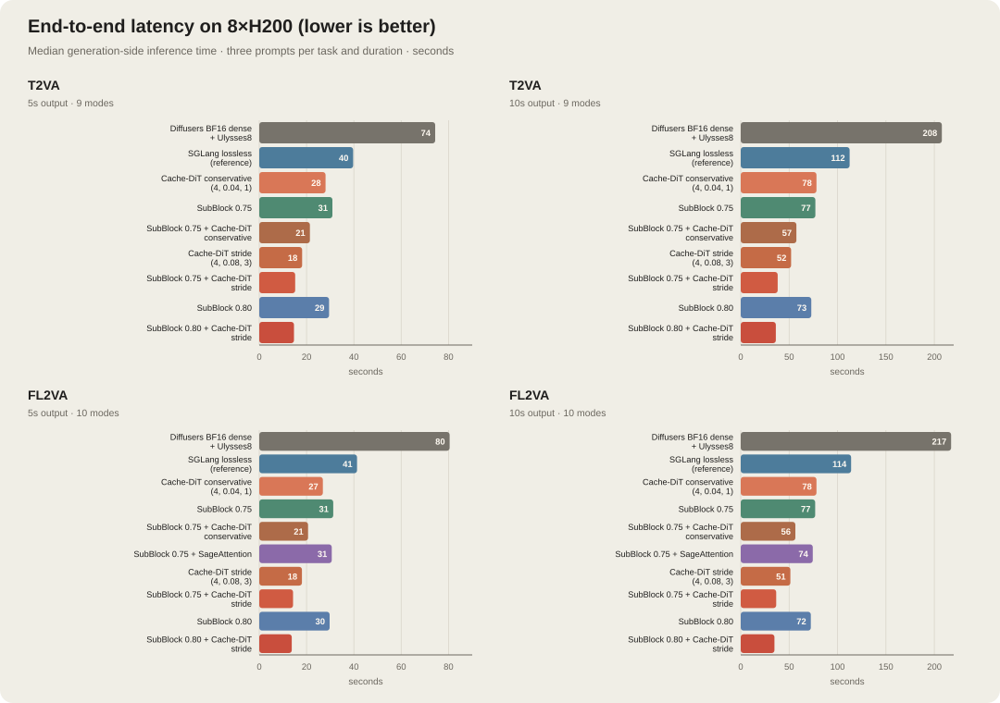
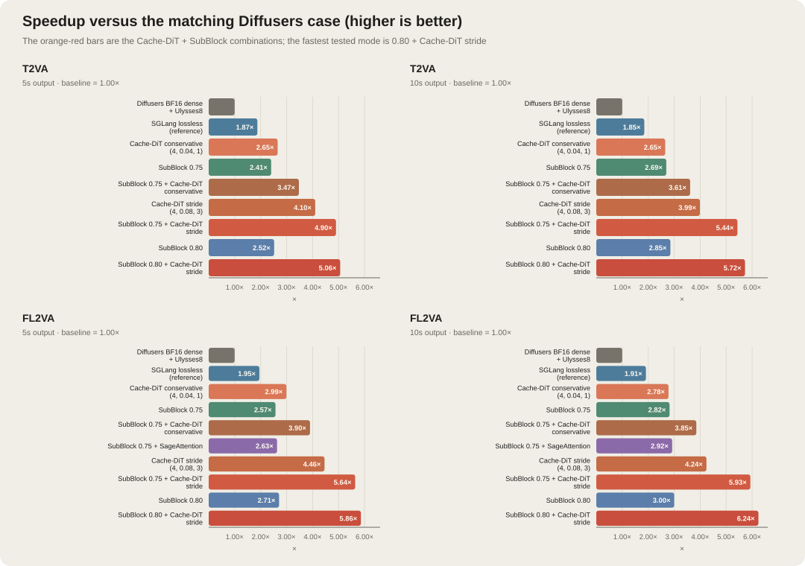
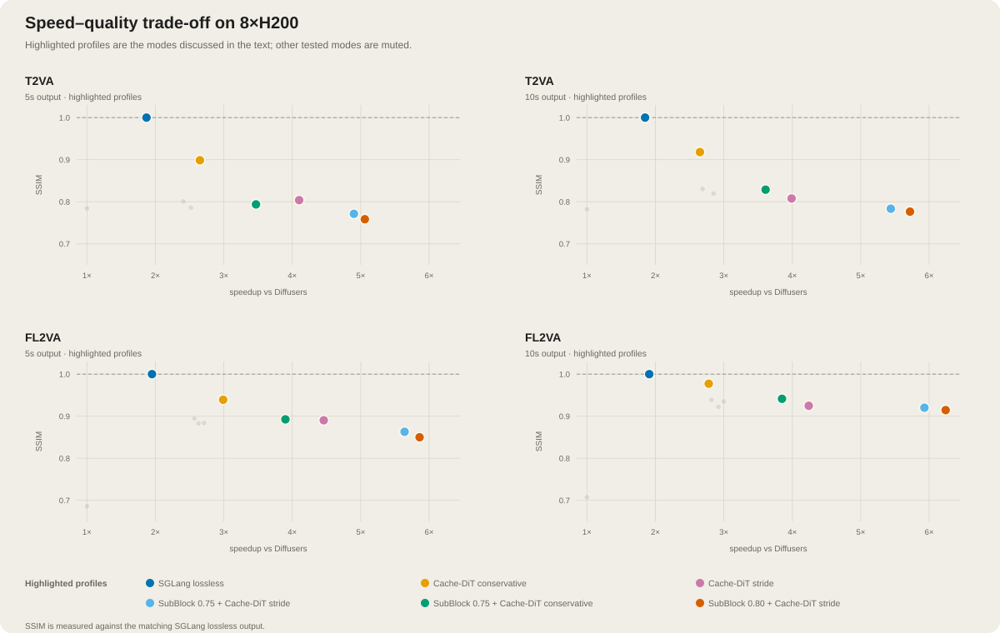
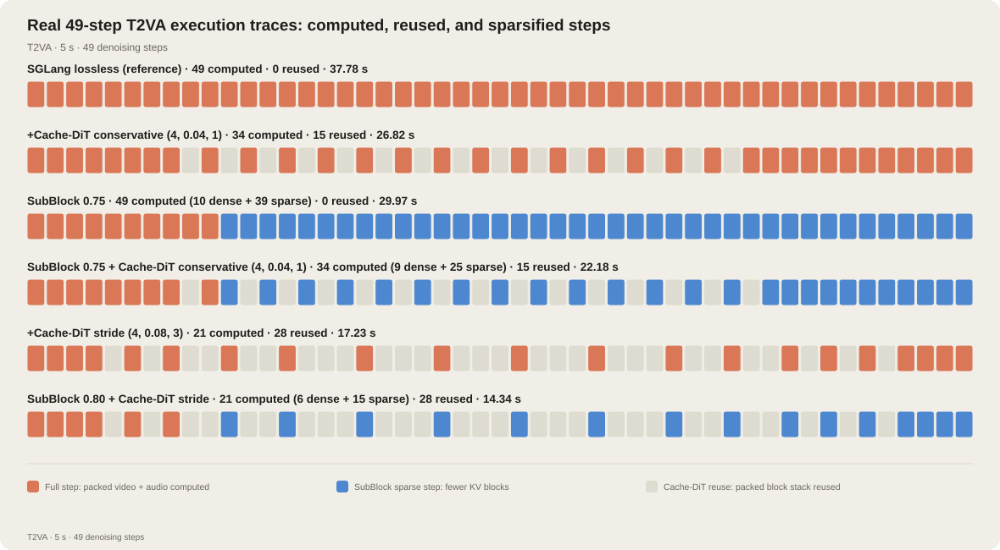
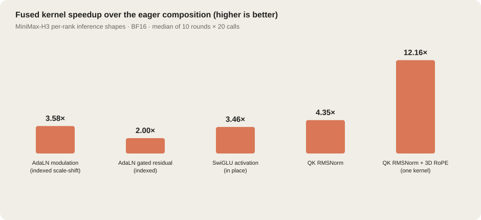
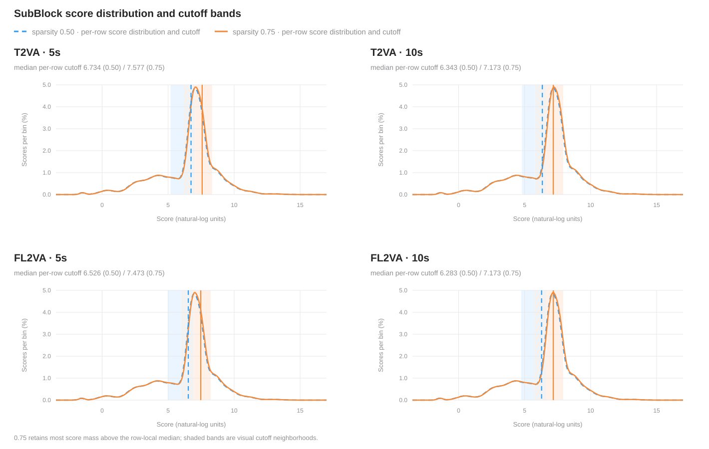

# MiniMax-H3 on 8×H200: up to a 6.24× speedup

> **SGLang Diffusion · MiniMax-H3 · 8× NVIDIA H200**

The H200 run compares the tested execution modes across six fixed workloads. With the
prompts, seeds, resolution, frame rate, and denoising settings held constant,
the fastest tested profile—**SubBlock 0.80 + Cache-DiT stride**—delivers
**5.06×/5.72×** speedups on 5-second/10-second T2VA and **5.86×/6.24×** on
FL2VA. SGLang's lossless path delivers a **1.85–1.95×** speedup over Diffusers;
the conservative Cache-DiT profile reaches up to **2.99×** while retaining
more similarity than the aggressive profiles.

|                 |                                                                               |
| --------------- | ----------------------------------------------------------------------------- |
| **Hardware**    | 8× NVIDIA H200 (141 GB)                                                       |
| **Workload**    | MiniMax-H3 · 1344×768 · 24 FPS · 50 denoising steps · 5 s and 10 s outputs    |
| **Parallelism** | All modes use 8 GPUs; Diffusers uses CP8, and SGLang uses SP/Ulysses degree 8 |
| **Measured**    | 2026-08-18                                                                    |

---

## 0x0 · At a glance

The answer depends on the baseline. Against the matched Diffusers case,
SGLang's dense, lossless path is already about 2× faster for both tasks and
both durations. Cache-DiT reuses work between denoising steps, while SubBlock
sparse attention reduces the cost of the steps that still run. Together they
form the fastest path in this matrix.

For a quality-first accelerated default, use **Cache-DiT conservative or
Cache-DiT stride** without SubBlock.
For a balanced speed/quality trade-off, use **SubBlock 0.75 + Cache-DiT stride**,
delivering 4.90–5.64× speedup at 5 s and 5.44–5.93× at 10 s.

The charts below summarize the aggregate benchmark tables.





---

## 0x1 · Detailed results

We report generation-side inference time; server startup, warmup, HTTP polling,
and MP4 download time are excluded. For each task and duration, latency and SSIM
are evaluated across three distinct prompts.
Speedup is measured against the matching Diffusers case.
SSIM is computed over all frames in YUV420 against the matching SGLang lossless
video.

### T2VA

| Mode                                   | 5 s median / speedup | 10 s median / speedup | 5 s mean SSIM | 10 s mean SSIM |
| -------------------------------------- | --------------------:| ---------------------:| -------------:| --------------:|
| Diffusers                              | 74.34 s / 1.00×      | 207.71 s / 1.00×      | 0.7842        | 0.7820         |
| SGLang lossless                        | 39.67 s / 1.87×      | 112.44 s / 1.85×      | 1.0000        | 1.0000         |
| Cache-DiT conservative                 | 28.02 s / 2.65×      | 78.28 s / 2.65×       | 0.8986        | 0.9179         |
| SubBlock 0.75                          | 30.90 s / 2.41×      | 77.12 s / 2.69×       | 0.8006        | 0.8301         |
| SubBlock 0.75 + Cache-DiT conservative | 21.41 s / 3.47×      | 57.48 s / 3.61×       | 0.7936        | 0.8288         |
| Cache-DiT stride                       | 18.13 s / 4.10×      | 52.07 s / 3.99×       | 0.8037        | 0.8078         |
| SubBlock 0.75 + Cache-DiT stride       | 15.16 s / 4.90×      | 38.21 s / 5.44×       | 0.7713        | 0.7834         |
| SubBlock 0.80                          | 29.49 s / 2.52×      | 72.85 s / 2.85×       | 0.7858        | 0.8193         |
| **SubBlock 0.80 + Cache-DiT stride**   | **14.68 s / 5.06×**  | **36.29 s / 5.72×**   | **0.7584**    | **0.7765**     |

### FL2VA

| Mode                                   | 5 s median / speedup | 10 s median / speedup | 5 s mean SSIM | 10 s mean SSIM |
| -------------------------------------- | --------------------:| ---------------------:| -------------:| --------------:|
| Diffusers                              | 80.44 s / 1.00×      | 217.31 s / 1.00×      | 0.6859        | 0.7073         |
| SGLang lossless                        | 41.31 s / 1.95×      | 114.02 s / 1.91×      | 1.0000        | 1.0000         |
| Cache-DiT conservative                 | 26.90 s / 2.99×      | 78.24 s / 2.78×       | 0.9389        | 0.9771         |
| SubBlock 0.75                          | 31.27 s / 2.57×      | 76.95 s / 2.82×       | 0.8946        | 0.9385         |
| SubBlock 0.75 + Cache-DiT conservative | 20.64 s / 3.90×      | 56.39 s / 3.85×       | 0.8924        | 0.9414         |
| SubBlock 0.75 + SageAttention          | 30.64 s / 2.63×      | 74.42 s / 2.92×       | 0.8827        | 0.9219         |
| Cache-DiT stride                       | 18.02 s / 4.46×      | 51.31 s / 4.24×       | 0.8903        | 0.9248         |
| SubBlock 0.75 + Cache-DiT stride       | 14.27 s / 5.64×      | 36.62 s / 5.93×       | 0.8629        | 0.9202         |
| SubBlock 0.80                          | 29.74 s / 2.71×      | 72.44 s / 3.00×       | 0.8837        | 0.9350         |
| **SubBlock 0.80 + Cache-DiT stride**   | **13.73 s / 5.86×**  | **34.80 s / 6.24×**   | **0.8498**    | **0.9144**     |

### Key takeaways

- **SGLang's dense path is the first easy win.** It delivers a 1.85–1.95× speedup over
  Diffusers across both tasks and durations, with the workload held constant.
- **SubBlock 0.75 + Cache-DiT stride is the balanced profile.** It keeps SSIM
  close to or above the corresponding Diffusers row across the matrix, while
  delivering 4.90–5.64× speedup at 5 seconds and 5.44–5.93× at 10 seconds.
- **Stride caching adds the largest throughput gain.** It reaches 3.99–4.46×
  on its own, compared with 2.65–2.99× for the conservative profile.
- **FL2VA benefits slightly more from cache + sparse combinations.** The
  fastest FL2VA case reaches 5.86×/6.24×, versus 5.06×/5.72× for T2VA.
- **The speed–quality trade-off is clear.** Conservative Cache-DiT retains
  0.8986–0.9771 SSIM; the aggressive 0.80 + stride profile gives up some of
  that margin for the lowest latency.



---

## 0x2 · Where the speedup comes from

Three mechanisms drive the profile-level gains.

**Fused kernels** reduce the cost of each step that still runs. The H3 path
fuses indexed AdaLN updates, gated residuals, SwiGLU activation, and QK RMSNorm
with 3D RoPE, reducing intermediate tensors, memory traffic, and kernel
launches. The next section reports these isolated kernel measurements; they are
part of the per-step implementation, while Cache-DiT and SubBlock determine
how much of that implementation is executed.

**Cache-DiT** attaches one DBCache context to MiniMax-H3's shared DiT block
stack. After the warmup steps, it evaluates the configured boundary blocks and
compares the normalized residual change with the previous cached state. If the
change stays below the threshold and the consecutive-cache limit allows it, the
middle blocks reuse their cached result; otherwise the stack is recomputed and
the cache is refreshed. All cache modes use `Fn=1`, `Bn=0`, and four warmup
steps:

- conservative: shared packed-stack RDT `0.04`, maximum consecutive cached steps `1`;
- stride: shared packed-stack RDT `0.08`, maximum consecutive cached steps `3`.

MiniMax-H3 has one `MiniMaxH3DiTModel` whose block stack carries packed video
and audio tokens. Cache-DiT therefore makes one shared decision for the whole
packed stack; it does not maintain independent video and audio caches. The
worker records one combined Cache-DiT step list, and the trace legend follows
that execution model.

**SubBlock sparse attention** reduces the KV blocks read on computed steps. It
uses `n_k=n_q=4`; the first ten denoising steps use dense attention, and SubBlock
is enabled afterward. The minimum sequence length is `4096`. The matrix tests
sparsity `0.75` and `0.80`; the latter is faster but has lower SSIM on several
T2VA cases.

The aggregate profile results show how the profiles behave end to end; they do
not isolate kernel time or provide a per-step cost breakdown. The trace below is a
request-level execution trace, not an operator timing measurement.

### One measured 49-step trace

The workload is configured with 50 inference steps. Because the sigma schedule
includes both interval endpoints, the denoising loop performs 49 model
evaluations (`len(sigmas) - 1`); “49-step trace” refers to these model
evaluations.

To make the execution pattern concrete, one 5-second T2VA request was run for
six profiles: lossless, Cache-DiT conservative,
SubBlock 0.75, SubBlock 0.75 + conservative Cache-DiT, Cache-DiT stride, and
SubBlock 0.80 + stride. The worker recorded the actual `cached_steps` list for
each request. Because video and audio tokens share one packed H3 block stack,
a cache hit reuses the combined output; there is no separate “video cached,
audio computed” state in this path. Blue cells in the SubBlock rows mark
computed steps that use sparse attention after the first ten denoising steps.



The trace-run timings are 37.78 s (lossless), 26.82 s (Cache-DiT conservative),
29.97 s (SubBlock 0.75), 22.18 s (SubBlock 0.75 + conservative Cache-DiT),
17.23 s (Cache-DiT stride), and 14.34 s (SubBlock 0.80 + stride). These numbers
identify the trace run; they do not replace the three-prompt aggregate medians.

---

## 0x3 · The kernel layer

Caching determines how many denoising steps run; kernels determine how fast
each computed step is. MiniMax-H3 packs video and audio tokens into one
sequence, so the non-GEMM path benefits from the same basic principle
throughout: less memory traffic, fewer intermediate tensors, and fewer kernel
launches. AdaLN modulation and gated residuals look up parameters by token
index and update the activation in one pass. SwiGLU operates directly on the
fused `gate_up` buffer. QK RMSNorm and 3D RoPE are fused into a single kernel
instead of running as separate eager operations.

The table below uses the real per-rank shape for a 5-second T2VA request at
1344×768×124 frames: 4,722 rows after SP/Ulysses-8 padding, hidden size 5,376,
56 attention heads, head dimension 128, RoPE dimension 96, and BF16 inputs.
Each number is the median per-call CUDA-event time across 10 rounds of 20
calls. The baseline is the corresponding eager composition.



| Operator                               | Eager composition | SGLang kernel | Speedup |
| -------------------------------------- | -----------------:| -------------:| -------:|
| AdaLN modulation (indexed scale-shift) | 136.7 μs          | 38.2 μs       | 3.58×   |
| AdaLN gated residual (indexed)         | 93.2 μs           | 46.6 μs       | 2.00×   |
| SwiGLU activation (in place)           | 364.5 μs          | 105.2 μs      | 3.46×   |
| QK RMSNorm                             | 334.0 μs          | 76.9 μs       | 4.35×   |
| QK RMSNorm + 3D RoPE, one kernel       | 1335.6 μs         | 109.8 μs      | 12.16×  |

These are microbenchmarks of the isolated sites, not additive end-to-end
latency savings. The fused QK-Norm + RoPE result uses the exact-rounding path
available on main (`round_norm_before_rope=True`).

---

## 0x4 · How SubBlock sparse attention works

SubBlock is a training-free router for block-sparse attention. It divides the
sequence into 64-token query and key blocks, then splits each block into four
16-token sub-blocks on both sides (`n_q=n_k=4`). A lightweight pooling and
log-sum-exp score estimates each key block's unnormalized softmax mass for each
query block and head. The router keeps the highest-scoring key
blocks and passes their indices to the block-sparse attention kernel; the full
attention matrix is never materialized.

The `sparsity` value is the fraction of key blocks allowed to be dropped, not
the fraction retained. Thus `sparsity=0.75` keeps roughly 25% of key blocks per
query block. The more aggressive `0.80` setting is faster but has a larger
approximation error budget, which is consistent with the lower SSIM observed
in the most aggressive rows.

The curves below show the score distributions; the vertical lines show the
medians of the per-row routing cutoffs for the two displayed budgets. Here,
`sparsity=0.50` is included as a diagnostic reference; the benchmark profiles
use `0.75` and `0.80`. Because the router ranks key blocks independently for
each query block and head, `sparsity=0.50` and `0.75` retain roughly the top
half and top quarter of that row's available key blocks, subject to 8-block
budget rounding. Across these workloads, the `0.75` budget retains most of the
score mass above the row-local median while concentrating selection on the
high-score tail.



The sparse path is enabled only for the long, non-causal DiT attention calls
that the kernel supports: BF16 inputs, head dimension 128, and sequences of at
least 4096 tokens. The first ten denoising steps use dense attention; short
segments, the token refiner, and unsupported calls use the dense fallback. On
H200/SM90, the selected 64×64 routing plan is executed by SGLang's CuTe
block-sparse FlashAttention kernel.

---

## 0x5 · Demos

The demo set contains four modes for each selected prompt:

- **Prompt 1** · T2VA · 5 s · three cats carrying brass instruments and playing beside a sleeping owner;
- **Prompt 2** · T2VA · 10 s · a rainy cyberpunk city at night;
- **Prompt 3** · FL2VA · 5 s · a clay fox continuation.

The four modes are SGLang lossless, Cache-DiT conservative, SubBlock 0.75 +
Cache-DiT stride, and SubBlock 0.80 + Cache-DiT stride. Filenames encode the
prompt, task, mode, and duration; the SVG figures are in the same folder.

| Prompt                 | SGLang lossless                                                         | Cache-DiT conservative                                                        | SubBlock 0.75 + stride                                                           | SubBlock 0.80 + stride                                                               |
| ---------------------- | ----------------------------------------------------------------------- | ----------------------------------------------------------------------------- | -------------------------------------------------------------------------------- | ------------------------------------------------------------------------------------ |
| Prompt 1 · T2VA · 5 s  | [video](minimax-h3-h200-assets/Prompt1__T2VA__sglang_lossless__5s.mp4)  | [video](minimax-h3-h200-assets/Prompt1__T2VA__cachedit_conservative__5s.mp4)  | [video](minimax-h3-h200-assets/Prompt1__T2VA__subblock_cachedit_stride__5s.mp4)  | [video](minimax-h3-h200-assets/Prompt1__T2VA__subblock_080_cachedit_stride__5s.mp4)  |
| Prompt 2 · T2VA · 10 s | [video](minimax-h3-h200-assets/Prompt2__T2VA__sglang_lossless__10s.mp4) | [video](minimax-h3-h200-assets/Prompt2__T2VA__cachedit_conservative__10s.mp4) | [video](minimax-h3-h200-assets/Prompt2__T2VA__subblock_cachedit_stride__10s.mp4) | [video](minimax-h3-h200-assets/Prompt2__T2VA__subblock_080_cachedit_stride__10s.mp4) |
| Prompt 3 · FL2VA · 5 s | [video](minimax-h3-h200-assets/Prompt3__FL2VA__sglang_lossless__5s.mp4) | [video](minimax-h3-h200-assets/Prompt3__FL2VA__cachedit_conservative__5s.mp4) | [video](minimax-h3-h200-assets/Prompt3__FL2VA__subblock_cachedit_stride__5s.mp4) | [video](minimax-h3-h200-assets/Prompt3__FL2VA__subblock_080_cachedit_stride__5s.mp4) |

<details>
<summary>Prompt 1 · full prompt</summary>

```text
integrated_multimodal_description: [Shot 1] Live-action, whimsical cinematic, a medium-wide shot frames a dim bedroom at night where the owner sleeps under the covers. A bedroom door opens and three cats enter in single file, each carrying a tiny brass instrument. The camera tracks sideways with small amplitude at slow speed as the cats march beside the bed and play a short, lively diegetic brass tune in synchrony; the sleeping owner shifts slightly but does not wake. The cats finish with one crisp flourish, pivot together, and abruptly file back out through the doorway, with the last cat's tail disappearing from frame. No character speaks and no human voice is heard.

overall_soundscape: Quiet nighttime room tone, the owner's steady breathing, soft pawsteps on the floor, a faint door creak, and light bedding rustle as the procession passes.

non_diegetic_music: N/A
```

</details>

<details>
<summary>Prompt 2 · full prompt</summary>

```text
integrated_multimodal_description: [Shot 1] Live-action, cinematic, a wide establishing shot frames a futuristic cyberpunk city at night as rain falls across dense towers, elevated transit lines, and a crowded street lined with vivid neon light. The camera pushes forward with small amplitude at slow speed above the wet pavement while pedestrians in reflective coats pass beneath transparent umbrellas, a compact hovering vehicle glides through the intersection, and saturated magenta, cyan, and amber reflections ripple across puddles. Steam drifts from a street vent and briefly catches the neon glow as the vehicle recedes between the towers. No dialogue or voiceover is heard.

overall_soundscape: Steady rainfall, distant traffic, the low hum of elevated transit, electrical buzzing from signs, soft footsteps through shallow water, and a brief rush of air as the hovering vehicle passes.

non_diegetic_music: A slow electronic pulse with deep analog bass, sparse metallic percussion, and sustained synthesizer tones that gradually increase in volume before fading.
```

</details>

<details>
<summary>Prompt 3 · full prompt</summary>

```text
For the target video, at 0.00 seconds into the target video, <Picture 1> is fully referenced.

integrated_multimodal_description:
[Shot 1] A handcrafted stop-motion clay animation begins from <Picture 1>. A small orange clay fox with large expressive eyes trots along a mossy path through a warm, richly detailed miniature forest. The camera tracks the fox smoothly at eye level while layered clay trees and shrubs create gentle parallax. The fox looks curiously toward the camera, slows near the middle of the path, flicks its tail, then continues toward the small wooden cabin in the distance. Preserve the exact clay textures, warm amber lighting, forest layout, fox proportions, and family-friendly whimsical tone established by <Picture 1>. Motion remains coherent and physically plausible for stop-motion animation.

overall_soundscape:
Soft clay footsteps, rustling leaves, distant birds, and a light forest breeze accompany the fox's movement.

non_diegetic_music:
A gentle playful score with pizzicato strings, wooden percussion, and soft flute.
```

</details>

---

SGLang Diffusion · MiniMax-H3 on 8× NVIDIA H200 · measured 2026-08-18
