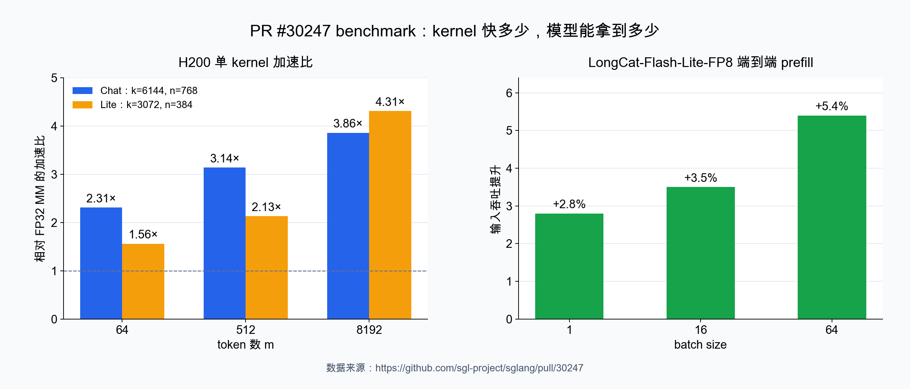

# 0x0. 前言

腾讯 HPC-Ops 里有一个挺有意思的 kernel：`gemm_bf16xfp32`。它算的是下面这个矩阵乘：

$$
Y_{m\times n}=X_{m\times k}^{\mathrm{BF16}}(W_{n\times k}^{\mathrm{FP32}})^T
$$

源码在这里：

https://github.com/Tencent/hpc-ops/blob/main/src/gemm/sm90/gemm_bf16xfp32.cu

这种 dtype 组合在 MoE router 里并不少见。前一层传来的 hidden states 通常是 BF16，router 权重为了减少专家选择抖动，往往保留 FP32。麻烦在于，Hopper Tensor Core 没有一条「BF16 输入乘 FP32 输入」的矩阵乘指令。把激活升到 FP32 可以算准，但走不了最快的 BF16 Tensor Core 路径；把权重直接降成 BF16 倒是快了，低 16 位信息也跟着没了。

HPC-Ops 的处理办法很直接：把一个 FP32 权重拆成高、低两个 BF16，分别做矩阵乘，再把结果合起来。乍看只是「用两次低精度计算模拟一次高精度计算」，真正值得琢磨的是误差为什么会从 $2^{-8}$ 降到 $2^{-16}$ 左右。这篇主要把这件事算清楚。

# 0x1. 直接把 FP32 权重转成 BF16，会丢掉多少信息

先看两种浮点格式：

| 格式 | 符号位 | 指数位 | 显式尾数位 | 有效精度 |
|---|---:|---:|---:|---:|
| FP32 | 1 | 8 | 23 | 24 bit |
| BF16 | 1 | 8 | 7 | 8 bit |

两者的指数位相同，所以能表示的数量级差不多。差别几乎全在尾数：FP32 有 24 位有效精度，BF16 只有 8 位。

设 `round_bf16` 使用 round-to-nearest。对一个处于正常数范围内的实数 $w$，舍入后的 BF16 数可以写成：

$$
\operatorname{round}_{\mathrm{BF16}}(w)=w(1+\delta),\qquad |\delta|\le u
$$

这里的 $u$ 是 BF16 的 unit roundoff：

$$
u=2^{-8}\approx 3.91\times 10^{-3}
$$

BF16 相邻数的间距大约是 $2^{-7}$ 倍当前数值，round-to-nearest 的最大误差取半个间距，所以界是 $2^{-8}$。这两个数经常被混在一起。

如果直接令

$$
w_b=\operatorname{round}_{\mathrm{BF16}}(w)
$$

那么单个权重的误差满足

$$
|w_b-w|\le u|w|.
$$

把它放进长度为 $k$ 的点积，纯粹由权重舍入造成的误差是

$$
\begin{aligned}
|x^T w_b-x^T w|
&=|x^T(w_b-w)|\\
&\le \sum_{i=1}^{k}|x_i|\,|w_{b,i}-w_i|\\
&\le u\sum_{i=1}^{k}|x_iw_i|.
\end{aligned}
$$

注意最后一行是绝对误差界。若 $x^Tw$ 里有大量正负抵消，真实结果可能接近零，此时相对误差可以很大，不能简单说输出也只有 $0.39\%$ 的相对误差。

用 LongCat-Flash Chat 的一个 router shape 做个小实验。激活是 BF16，权重是 FP32，参考结果用 FP32 GEMM：

```python
import torch

torch.manual_seed(0)
x = torch.randn(64, 6144, device="cuda").bfloat16()
w = torch.randn(768, 6144, device="cuda")

ref = x.float() @ w.t()
naive = torch.mm(x, w.bfloat16().t(), out_dtype=torch.float32)
print((naive - ref).abs().max())
```

这次运行得到的最大绝对误差是 `0.5775`。router 后面还要按 logits 选 top-k 专家；两个专家的分数挨得很近时，半个点左右的偏差足以改变排序。直接转 BF16 在这里有点粗。

# 0x2. 把一个 FP32 数拆成两个 BF16

## 2.1 拆分公式

HPC-Ops 使用的 scale 是

$$
s=\frac{1}{256}=2^{-8}.
$$

对每个 FP32 权重 $w$，先取一份 BF16 高位：

$$
w_h=\operatorname{round}_{\mathrm{BF16}}(w).
$$

然后计算它没有覆盖到的残差：

$$
r=w-w_h.
$$

残差比原数小约 $2^8$ 倍。HPC-Ops 先把它放大 256 倍，再转 BF16：

$$
w_l=\operatorname{round}_{\mathrm{BF16}}\left(\frac{r}{s}\right)
=\operatorname{round}_{\mathrm{BF16}}(256r).
$$

使用时再乘回 $s$：

$$
\widehat{w}=w_h+s w_l.
$$

对应的 PyTorch 代码只有三行：

```python
scale = 1 / 256
w_high = w.to(torch.bfloat16)
w_low = ((w - w_high.float()) / scale).to(torch.bfloat16)

# 两个 GEMM 都使用 BF16 输入、FP32 accumulator
y_high = torch.mm(x, w_high.t(), out_dtype=torch.float32)
y_low = torch.mm(x, w_low.t(), out_dtype=torch.float32)
y = y_high + scale * y_low
```

乘 256 不是经验参数。256 是 2 的整数次幂，正常数范围内乘除它只会改二进制指数，不会碰尾数，因此这一步本身不损失有效位，也把 low operand 拉回到接近原权重的量级。

这里容易产生一个误解：把残差放大，并不会让正常的 BF16 凭空多出尾数位。浮点数保留的是相对精度，只要 $r$ 仍是正常数，直接把 $r$ 转成 BF16，同样能得到后面推导的 $u^2$ 误差界。缩放主要把低位矩阵的数值范围归一化，并让极小残差更不容易落入 subnormal；选择 2 的整数次幂，则保证归一化本身不引入新的舍入。

先用十进制打个比方。假设一种格式只能保留 3 位有效数字，要表示 `1.234567`：

```text
high     = 1.23
residual = 0.004567
low      = round_3_digits(1000 * residual) = 4.57
rebuild  = high + low / 1000 = 1.23457
```

直接保留 3 位时误差是 `0.004567`，拆成两段后只剩 `0.000003`。BF16 版本做的是同一件事，只是底数换成了 2，一段保留 8 位有效精度。

## 2.2 为什么重建误差是二阶小量

下面把误差推一遍。仍假设数值处于正常范围，并采用 round-to-nearest。

第一次 BF16 舍入写成

$$
w_h=w(1+\delta_h),\qquad |\delta_h|\le u.
$$

所以残差为

$$
r=w-w_h=-w\delta_h,
$$

从而

$$
|r|\le u|w|.
$$

低位的 BF16 舍入写成

$$
w_l=\frac{r}{s}(1+\delta_l),\qquad |\delta_l|\le u.
$$

代回重建公式：

$$
\begin{aligned}
\widehat{w}
&=w_h+s w_l\\
&=w_h+s\frac{r}{s}(1+\delta_l)\\
&=w_h+r+r\delta_l\\
&=w+r\delta_l.
\end{aligned}
$$

高位第一次舍入产生的误差，已经被残差 $r$ 补回去了。最后留下的只是「残差本身的舍入误差」：

$$
|\widehat{w}-w|
=|r\delta_l|
\le u^2|w|
=2^{-16}|w|.
$$

$2^{-16}\approx 1.53\times10^{-5}$。也就是说，直接 BF16 舍入的权重误差是一阶的 $u$，拆成两段后是二阶的 $u^2$，大致从 8 位有效精度变成 16 位。它仍然没有恢复 FP32 的 24 位精度，这一点不能省略。

实现里 `w - w_high.float()` 在 FP32 中计算。$w_h$ 转回 FP32 后仍可精确表示，而且它和 $w$ 很接近；除去极端的下溢情形，这个减法满足 Sterbenz lemma 的条件，残差可以精确得到。随后乘 256 也只是移动指数。这样一来，上面的推导并没有偷偷忽略一轮 FP32 残差计算误差。

## 2.3 误差传到点积以后是什么样

记

$$
\Delta w=\widehat{w}-w.
$$

先只考虑权重表示误差，不考虑 GEMM 累加的舍入，则

$$
\begin{aligned}
|x^T\widehat{w}-x^Tw|
&=|x^T\Delta w|\\
&\le \sum_{i=1}^{k}|x_i|\,|\Delta w_i|\\
&\le u^2\sum_{i=1}^{k}|x_iw_i|.
\end{aligned}
$$

对矩阵乘的每个输出元素也是同一个界：

$$
|(X\widehat{W}^T-XW^T)_{mn}|
\le u^2\sum_{j=1}^{k}|X_{mj}W_{nj}|.
$$

这个式子能说明两件事。第一，和直接把权重转成 BF16 相比，权重近似误差的上界从 $u$ 缩到 $u^2$，理论上差约 256 倍。第二，它仍然是绝对误差界。如果一个输出由很大的正数和负数抵消而来，右边不会跟着变小，相对误差也就没有统一保证。

真实 kernel 还多两类舍入：两个 BF16 点积各自在 FP32 accumulator 里累加，最后再做一次 `acc_high + scale * acc_low`。对长度为 $k$ 的普通 FP32 逐项累加，常见的最坏情况系数是

$$
\gamma_k=\frac{ku_{32}}{1-ku_{32}},\qquad u_{32}=2^{-24}.
$$

Tensor Core 的归约顺序不等同于一条从左加到右的循环，常数会有所不同，但结论没变：$2^{-16}$ 描述的是双 BF16 对权重的表示误差，不是对整个 GEMM 做逐位正确的承诺。实际精度要看权重分解、FP32 累加和最终融合共同产生的误差。

把上一节的实验换成双 BF16 分解：

```python
scale = 1 / 256
w_high = w.to(torch.bfloat16)
w_low = ((w - w_high.float()) / scale).to(torch.bfloat16)

split = (
    torch.mm(x, w_high.t(), out_dtype=torch.float32)
    + scale * torch.mm(x, w_low.t(), out_dtype=torch.float32)
)
print((split - ref).abs().max())
```

同一组输入下，最大绝对误差从 `0.5775` 降到 `0.0012`。这个比值不是固定常数，换随机种子、shape 或归约顺序都会变；它说明双 BF16 的误差已经落到了另一档。

## 2.4 这笔交换划不划算

拆分后要做两个 BF16 GEMM，计算量是一份 BF16 GEMM 的两倍。两份 BF16 权重一共占 4 字节，和原来的 FP32 权重一样大；如果拿它和「直接存一份 BF16 权重」相比，权重读取量则是两倍。权重通常只在加载后拆一次，不必每次 forward 都重算。

换回来的东西是 BF16 Tensor Core 吞吐。只要 GPU 上 BF16 Tensor Core 相对 FP32 路径足够快，两次 BF16 GEMM 仍可能比一次 FP32 GEMM 便宜。手写 kernel 还能复用激活 tile，并在一次 epilogue 里完成高、低两路融合，省掉额外的中间结果和 kernel launch。至于具体能快多少，取决于 $m,n,k$、GPU、调度以及小矩阵启动开销，不能只拿峰值 FLOPS 相除。

本文不展开 CUDA 实现。想看 kernel 本身，可以直接读上游文件：

https://github.com/Tencent/hpc-ops/blob/main/src/gemm/sm90/gemm_bf16xfp32.cu

逐行解析在这里：

https://github.com/BBuf/how-to-optim-algorithm-in-cuda/blob/master/cutlass/cute/HPC-Ops%20gemm_bf16xfp32%20kernel%E9%80%90%E8%A1%8C%E8%A7%A3%E6%9E%90%EF%BC%9A%E4%BB%8ECuTe%E5%9F%BA%E7%A1%80%E5%88%B0Hopper%20warp%20specialization.md

# 0x3. SGLang PR #30247 的 benchmark

SGLang PR #30247 在 LongCat-Flash router 上直接使用 HPC-Ops 提供的 `hpc.gemm_bf16xfp32`。PR 地址：

https://github.com/sgl-project/sglang/pull/30247

下面的数据取自本文整理时的 PR 描述。先看 H200 上的 microbenchmark。基线是 `x.float() @ w.t()`，表里的 HPC 是 `hpc.gemm_bf16xfp32`：

| router shape | m | HPC-Ops | FP32 MM | 加速比 |
|---|---:|---:|---:|---:|
| Chat：k=6144, n=768 | 64 | 15.5 us | 35.6 us | 2.31x |
| Chat：k=6144, n=768 | 512 | 38.4 us | 120.4 us | 3.14x |
| Chat：k=6144, n=768 | 8192 | 430.0 us | 1661.1 us | 3.86x |
| Lite：k=3072, n=384 | 64 | 14.8 us | 23.1 us | 1.56x |
| Lite：k=3072, n=384 | 512 | 20.7 us | 44.1 us | 2.13x |
| Lite：k=3072, n=384 | 8192 | 113.1 us | 487.8 us | 4.31x |



单 kernel 是 router forward 里的一小段，整网不会跟着快 1.56 到 4.31 倍。PR 还在 H200 TP1 上对 LongCat-Flash-Lite-FP8 做了模型级 A/B。GSM8K 共 1319 题，结果如下：

| 版本 | GSM8K accuracy | Invalid |
|---|---:|---:|
| main | 0.798 | 0.000 |
| PR #30247 | 0.802 | 0.001 |

这个结果没有观察到明显的精度回退，但也不该写成「两条路径数值完全相同」。前面的误差推导已经说明，双 BF16 只是把权重近似误差压低，并没有让计算逐位等同于 FP32 GEMM。

`bench_one_batch_server` 使用 `input=1024, output=128`。输入和输出吞吐数据是：

| batch size | 指标 | main | PR #30247 | 变化 |
|---:|---|---:|---:|---:|
| 1 | input tok/s | 15190 | 15613 | +2.8% |
| 16 | input tok/s | 68588 | 71021 | +3.5% |
| 64 | input tok/s | 62175 | 65509 | +5.4% |
| 1 | output tok/s | 242.4 | 244.8 | +1.0% |
| 16 | output tok/s | 2111.2 | 2104.7 | -0.3% |
| 64 | output tok/s | 5569.1 | 5549.5 | -0.4% |

prefill 时 router GEMM 的 $m$ 是本轮一起处理的 token 数，`input=1024` 很容易越过加速路径的门槛，所以输入吞吐拿到了 `2.8%` 到 `5.4%` 的端到端收益。decode 的 $m$ 近似 batch size；这里最大只有 64，低于 Lite shape 使用 HPC-Ops 的 `m=128` 门槛，走的是原来的 FP32 MM，输出吞吐基本持平。

这组数据也给出了这类优化比较实际的量级：大 $m$ 下，router GEMM 本身能快几倍；放回完整模型后，prefill 吞吐提升几个百分点。前一个数字说明 kernel 值得做，后一个数字才是服务侧真正拿到的收益。
