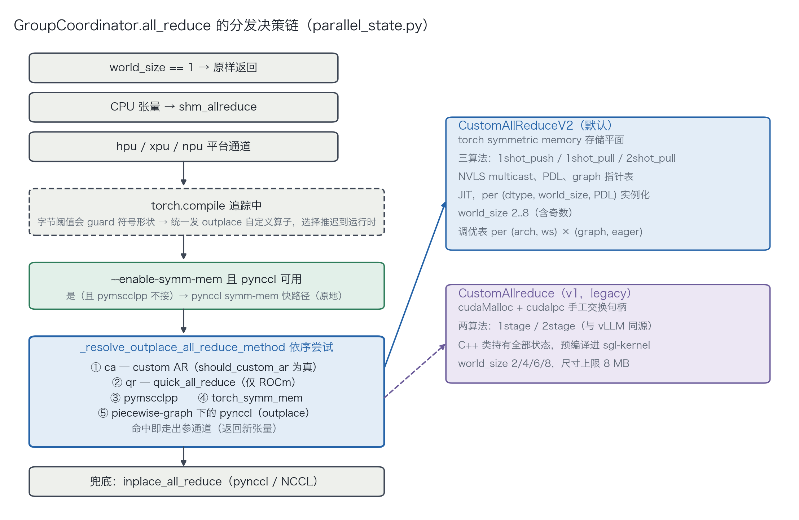
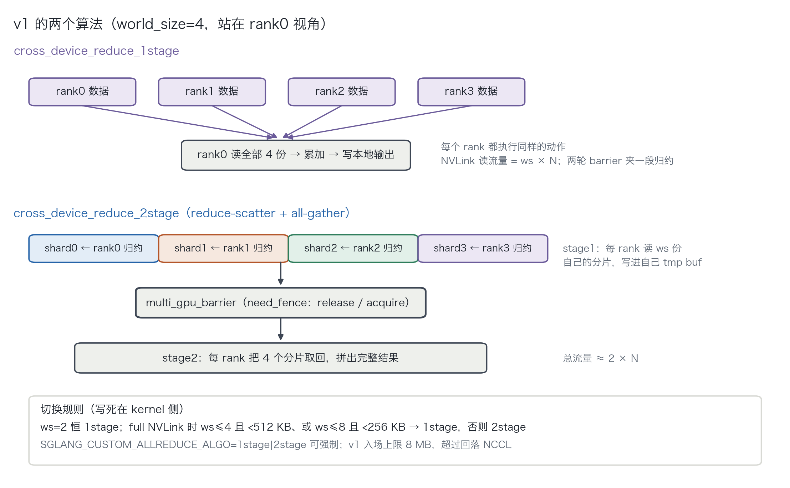
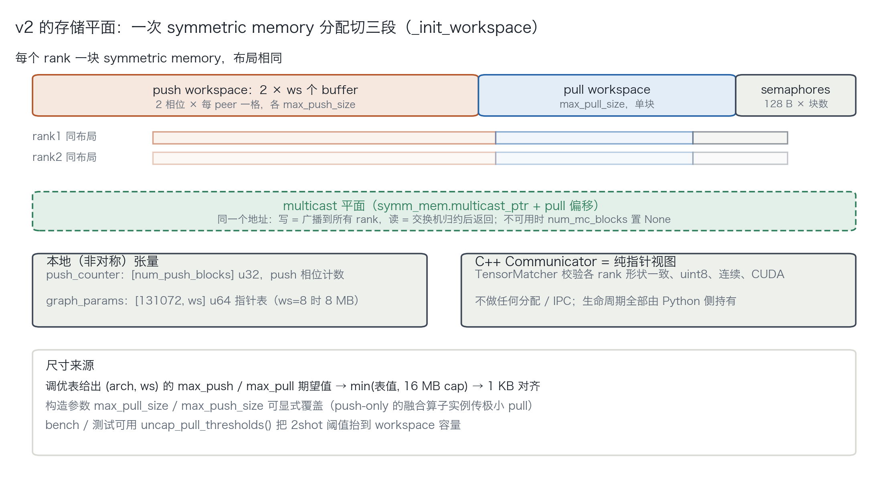
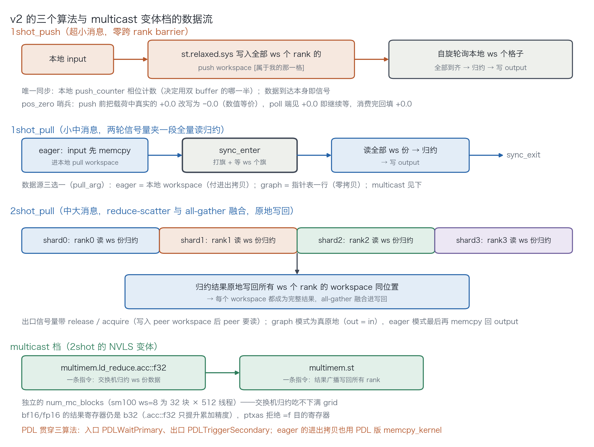
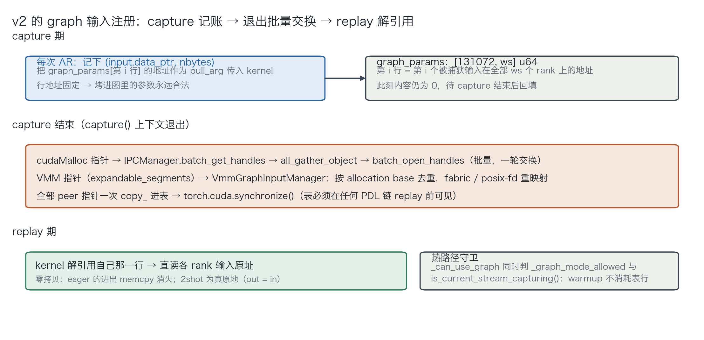
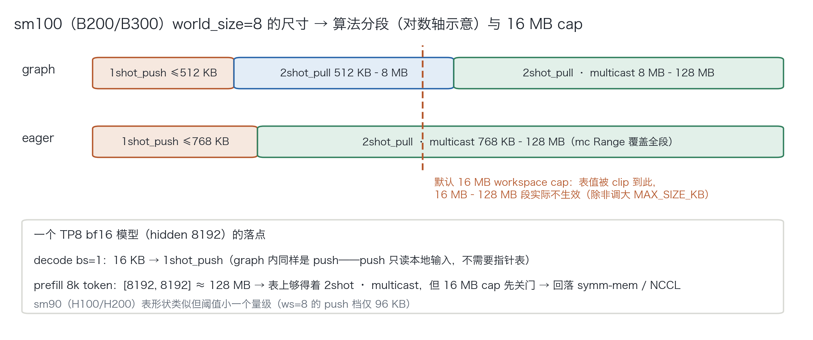

# 0x0. 前言

TP 并行下每个 transformer 层至少有两次 all-reduce（attention o_proj 之后、MLP/MoE down_proj 之后），几十上百层的模型 decode 一步就是几百次 all-reduce，而每次传输的数据量很小（bs=1、hidden 8192 的 bf16 模型是 16 KB）。这个负载特征决定了瓶颈在延迟而不是带宽，NCCL 这类为大消息和任意拓扑设计的通用库在这个区间开销偏大，所以 SGLang 里有两代自定义 all-reduce 实现：从 vLLM 移植的 custom allreduce（下称 v1，`SGLANG_OPT_USE_CUSTOM_ALL_REDUCE_V2=0` 时启用）和现在默认的 allreduce v2。

v2 相比 v1 的主要变化是：存算分离的代码结构、多出一个 push 算法、NVLS multicast 硬件归约、PDL、集中式 CUDA graph 指针表，以及把算法切换阈值从写死的常量换成 per-(架构, world_size) 的实测调优表。

这篇文章记录一下这两代实现的技术细节，代码口径是 sglang main `@a23f6ea09`（kernels 命名空间重构之后的路径），涉及的文件：

- `python/sglang/srt/distributed/parallel_state.py`
- `python/sglang/srt/distributed/device_communicators/custom_all_reduce.py`（v1 Python 侧）
- `sgl-kernel/csrc/allreduce/custom_all_reduce.cuh`（v1 kernel）
- `python/sglang/srt/distributed/device_communicators/custom_all_reduce_v2.py`（v2 Python 侧）
- `python/sglang/srt/distributed/device_communicators/configs/custom_all_reduce_v2.py`（调优表）
- `python/sglang/kernels/jit/csrc/distributed/custom_all_reduce.cuh`（v2 kernel）

# 0x1. 负载特征：为什么小消息需要专门的实现

all-reduce 是把所有参与者的数据逐元素归约（这里是求和），并且让每个参与者都拿到完整结果。TP 把每层的权重矩阵切给多张 GPU，每张卡用自己那一份权重算出的只是输出的部分和，逐元素相加才是正确结果，这个加法由 all-reduce 完成。

decode 阶段的消息尺寸很小：bs=1 时一次 all-reduce 只有 `hidden × 2` 字节，hidden 8192 的 bf16 模型是 16 KB。一步几百次这样的调用，总时间由每次调用的固定开销决定，而不是由链路带宽决定。

NCCL 在这个区间的开销来自几个方面：ring 算法的多跳（world_size=4 时 all-reduce 要走 `2(ws-1)=6` 步），协议选择与 kernel 内的 proxy 逻辑，以及 CUDA graph 场景下每次调用携带的参数块本身构成的图节点成本——百余次每步累加起来是毫秒量级。

custom allreduce 的做法是在全 NVLink P2P 互连的前提下让 GPU 直接读写对端显存，用一个或两个 kernel 完成整个 all-reduce，绕开通用协议栈。代价是适用范围窄：单机、全互连、world_size ≤ 8、消息不超过 workspace 上限。

# 0x2. 前提条件：NVLink P2P 与 IPC 交换

理解后续实现需要三个前提：

1. NVLink：同机 GPU 之间的高速互连；
2. P2P 直读直写：在全 NVLink 互连的机器上，GPU0 的 kernel 可以持有一个指针直接读写 GPU1 的显存，语义上和访问本地显存一致，不需要显式的消息收发。这是 custom allreduce 成立的物理前提；
3. 地址需要先交换：GPU0 要访问 GPU1 的某块显存，需要 GPU1 先导出内存句柄、GPU0 侧 `cudaIpcOpenMemHandle` 打开映射，才能得到本进程可解引用的指针。这个手续 v1 手工完成，v2 交给 torch 的 symmetric memory。

需要注意 IPC 和 VMM 重映射都是节点内机制，这也是 custom allreduce 只适用于单机的原因之一。

# 0x3. all_reduce 的分发链

custom AR 不是唯一的候选实现。`GroupCoordinator.all_reduce`（`parallel_state.py`）的完整决策链如下：



分发链上有三处顺序需要说明。

第一，`--enable-symm-mem` 打开时，pynccl 的 symmetric-memory 快路径排在整个 outplace 链之前，且无条件接走所有 GPU 输入，custom AR（v1 与 v2 都是）不会被调用。这两个特性在部署上是互斥的，需要按消息谱和硬件实测二选一。

第二，custom AR 走出参通道（返回新张量），pynccl/NCCL 走原地通道，上层 `tensor_model_parallel_all_reduce` 对两者做了统一封装。

第三，`torch.compiler.is_compiling()` 分支：所有按字节数选算法的逻辑（`_pick_algo`、`should_mscclpp_allreduce`）在 Dynamo 追踪下会对符号形状产生 guard 并逐形状重编译，因此 compile 路径把通道选择整体推迟到 opaque 自定义算子内部的运行时进行。

两代实现的切换由 `SGLANG_OPT_USE_CUSTOM_ALL_REDUCE_V2`（默认 True）控制，`--disable-custom-all-reduce` 则两代全关。

# 0x4. 跨 rank 同步：v1 的 Signal 与 barrier

P2P 直读需要解决一个问题：GPU0 读 GPU1 的数据时，如何确认 GPU1 已经写完。两张卡的 kernel 独立执行，读早了会拿到上一轮的残留数据，且不会报错。

解决办法是 barrier：每个 rank 维护一组计数器，写完数据后把当前轮次号写入所有 peer 的对应槽位，然后自旋等待自己的槽位收齐所有 peer 的同一轮次号。v1 用 `Signal` 结构承载这组计数器：

```c++
// 来源：sglang/sgl-kernel/csrc/allreduce/custom_all_reduce.cuh
struct Signal {
  // 本 rank 每个 block 的本地轮次计数
  alignas(128) FlagType self_counter[kMaxBlocks][8];
  // 接收 peer 旗标的槽位。两组交替使用：peer 的 block 可能已经到达第二个
  // 同步点并开始写 counter+1，而本 rank 的 block 还在第一个同步点等待
  // counter，交替数组避免两个相位互相覆盖
  alignas(128) FlagType peer_counter[2][kMaxBlocks][8];
};  // kMaxBlocks = 36（HIP 为 60）
```

barrier 本体每个 block 只使用前 `world_size` 个线程：

```c++
// 来源：sglang/sgl-kernel/csrc/allreduce/custom_all_reduce.cuh
template <int ngpus, bool is_start, bool need_fence = false>
DINLINE void multi_gpu_barrier(const RankSignals& sg, Signal* self_sg, int rank) {
  if constexpr (!is_start) __syncthreads();
  if (threadIdx.x < ngpus) {
    // 轮次号自增。一个计数器在语义上足够，每 block 一份是为了避免经
    // smem 共享计数器
    auto val = self_sg->self_counter[blockIdx.x][threadIdx.x] += 1;
    // 向 rank tx 的槽位写入轮次号，再自旋等待自己槽位中 rank tx 的轮次号
    auto peer_counter_ptr = &sg.signals[threadIdx.x]->peer_counter[val % 2][blockIdx.x][rank];
    auto self_counter_ptr = &self_sg->peer_counter[val % 2][blockIdx.x][threadIdx.x];
    if constexpr (need_fence) {
      // st.release.sys / ld.acquire.sys：跨设备内存序，保证旗标可见时数据已可见
      st_flag_release(peer_counter_ptr, val);
      while (ld_flag_acquire(self_counter_ptr) != val);
    } else {
      // st/ld volatile：只保证到达，不保证顺序，用在数据依赖由别处保证的位置
      st_flag_volatile(peer_counter_ptr, val);
      while (ld_flag_volatile(self_counter_ptr) != val);
    }
  }
  if constexpr (is_start || need_fence) __syncthreads();
}
```

两个模板参数的作用：`is_start` 区分入口/出口 barrier（决定 `__syncthreads()` 放在前还是后），`need_fence` 决定用 release/acquire 还是 volatile。入口 barrier 不需要 fence，因为此时要保证的只是「所有 rank 都到达」；出口 barrier 之后 peer 要读本 rank 写入的数据，需要内存序。

v2 的 `Semaphore` 是同一思路的另一种实现，见 0x7.2。

# 0x5. v1 的实现

## 0x5.1 存储与 IPC 交换

v1 每个 rank 在初始化时手工 `cudaMalloc` 三块内存，把 IPC handle all-gather 给所有 peer 并各自打开映射：

```
meta_ptrs   = Signal 同步区 + max_size 中转缓冲   （连续分配，get_tmp_buf = Signal 尾后）
buffer_ptrs = max_size 预注册输入缓冲              （eager 模式输入先 copy 进来再归约）
rank_data   = 8 MB 本地表，存 RankData{ptrs[8]}   （graph 模式的指针表，131072 条容量）
```

## 0x5.2 两个 kernel：1stage 与 2stage



**1stage**：每个 rank 把数据放进自己的公共缓冲区，barrier，然后读取全部 `ws` 份数据在本地累加并写出，再 barrier。NVLink 读流量是 `ws × N`，存在冗余，但小消息下带宽不是瓶颈，省下的是第二轮同步。

```c++
// 来源：sglang/sgl-kernel/csrc/allreduce/custom_all_reduce.cuh（cross_device_reduce_1stage 主体）
multi_gpu_barrier<ngpus, true>(sg, self_sg, rank);
// grid-stride 遍历本线程负责的元素，把 ws 个 rank 的同位置数据累加
for (int idx = blockIdx.x * blockDim.x + threadIdx.x; idx < size; idx += gridDim.x * blockDim.x) {
  ((P*)result)[idx] = packed_reduce<P, ngpus, A>((const P**)&dp.ptrs[0], idx);
}
multi_gpu_barrier<ngpus, false>(sg, self_sg, rank);
```

**2stage**：即 reduce-scatter + all-gather。stage1 每个 rank 只负责 `1/ws` 的分片，把 `ws` 家的这一段读来累加后写回自己的中转缓冲；barrier（带 `need_fence`）；stage2 每个 rank 把其它 rank 算好的分片取回拼成完整结果。总流量约 `2 × N`，代价是多一轮带内存序的同步。

2stage 有一个正确性约束写在源码注释里：**两个 stage 必须使用相同的 tid 映射**。跨设备的写可见性只在同 tid 的线程之间由 barrier 保证，stage1 中计算 `start+i` 的线程，stage2 中也必须由它去 gather `start+i`。

两个 kernel 都不按「距离」重排指针数组（1stage 直接按 `dp.ptrs[0..ws)` 原序累加），目的是让所有 rank 的浮点累加顺序一致、输出位一致，这一点在 0xa.1 展开。block 数上限 36 的原因是注释里提到的 NVLink 总线争用：更多 SM 参与会加剧争用，36 是 A100/H100 一带的实测值。

算法切换规则写死在 kernel 侧：ws=2 恒用 1stage；full NVLink 时 ws≤4 且 <512 KB、或 ws≤8 且 <256 KB 用 1stage，否则 2stage。`SGLANG_CUSTOM_ALLREDUCE_ALGO=1stage|2stage` 可强制指定。v1 的入场上限是 8 MB（HIP 16 MB），超过则回落 NCCL。

## 0x5.3 v1 的 CUDA graph 支持

先说明 graph 带来的约束。decode 每步要发射几百上千个 kernel，CPU 逐个下发的开销不可忽略，CUDA graph 把一步的 kernel 序列 capture 下来反复 replay，把这部分开销降到接近零，SGLang 的 decode 默认在 graph 内执行。但 replay 要求所有 kernel 参数（包括指针）与 capture 时一致，而 custom AR 的 kernel 需要读「每个 rank 上输入张量的地址」，capture 期间无法做跨 rank 的 host 同步来交换这些地址。

v1 的处理方式是延迟注册：capture 期间每遇到一次 all-reduce，把 kernel 的 `RankData*` 参数指向 `rank_data` 表的下一个空位（此时内容无效），同时把本地输入指针记入 `graph_unreg_buffers_`；capture 结束后 `register_graph_buffers` 取每个指针的 allocation base 做 `cudaIpcGetMemHandle`，广播交换、打开映射，把真实的 `ws` 个 peer 指针写入当初的占位条目。replay 时 kernel 解引用得到的就是有效指针，不需要额外拷贝。eager 模式不走这条路径：输入先 copy 进预注册的 `buffer_ptrs` 再归约，多付一次拷贝。

# 0x6. v2 的结构：存算分离

v2 的文件头 docstring 描述了它的结构划分：CUDA 侧分成两个部分，`Communicator` 是对 symmetric memory workspace 的指针持有者（所有存储由 Python 侧分配和拥有），all-reduce kernel 是一个纯函数 `(input, comm, algo, pull_arg)`。v1 把 IPC、注册表、算法选择都放在 C++ 类里，v2 的 C++ 侧不含任何生命周期逻辑，状态机在 Python 侧。

这个划分带来两个结果：JIT 实例只按 (dtype, world_size, 是否 PDL) 编译，一次编译服务所有配置；所有尺寸、块数、阈值成为 Python 侧可调的数据，而不是编译期常量。



存储侧的变化是指针交换的方式。v1 手工走 cudaIpc handle 的 all-gather；v2 调用 torch 的 `_SymmetricMemory.empty_strided_p2p` 并 rendezvous，每个 rank 分配一块布局相同的内存，句柄交换由 torch 完成，同时得到 NVLS multicast 地址（用于 0x7.4）。这块内存切成三段：

```
push workspace : 2 × ws 个 buffer（各 max_push_size）
                 ws 个槽位对应「每个 peer 写给我的位置」，×2 是双相位，
                 相邻两次调用交替使用，避免上一次未消费完就被覆盖
                 （与 v1 peer_counter[2] 同一思路）
pull workspace : max_pull_size，单块
semaphores     : 128 B × 块数（每 block 一个 Semaphore，128 B 对齐避免伪共享）
```

另有两个本地（非对称）张量：`push_counter`（push 算法的相位计数）和 `graph_params`（`[131072, ws]` 的 u64 指针表，ws=8 时占 8 MB，见 0x8）。尺寸取值来自调优表给出的 (arch, ws) 期望值，再与 16 MB workspace cap（`SGLANG_CUSTOM_ALL_REDUCE_V2_MAX_SIZE_KB`）取 min 并做 1 KB 对齐。

这套存储平面不是 all-reduce 专用的：main 里 fused TP QK-norm 会创建 pull 极小化的 push-only v2 实例，复用同一套 workspace 与信号量协议。

# 0x7. v2 的三个算法

v2 的算法集合是 1shot_push、1shot_pull、2shot_pull，以及 2shot_pull 的 multicast 变体档。



## 0x7.1 1shot_push

v1 的 1stage 是 pull 语义：等所有 rank 把数据放好，然后各自去读。v2 增加的 push 是相反方向：本 rank 用 `st.relaxed.sys` 把数据写入全部 `ws` 个 rank 的 push workspace 中属于自己的槽位，接收侧自旋轮询本地的 `ws` 个槽位，数据到齐后归约写出。这条路径没有跨 rank barrier，唯一的同步是本地的 `push_counter` 相位计数（决定使用双 buffer 的哪一半）。

数据是否到达由载荷本身判定，实现方式是用 +0.0 的位型作为「槽位为空」的哨兵：

```c++
// 来源：sglang/python/sglang/kernels/jit/csrc/distributed/custom_all_reduce.cuh
template <>
struct fp_trait<bf16_t> {
  using type = uint16_t;
  static constexpr uint16_t pos_zero = 0x0000u;   // +0.0 位型，用作「空」标记
  static constexpr uint16_t neg_zero = 0x8000u;   // -0.0，数值等价的替代表示
};

// push 前：把载荷中真实出现的 +0.0 改写为 -0.0
// IEEE 754 下两者数值相等，参与加法的结果不变
template <typename DType>
SGL_DEVICE void clear_pos_zero(DType& val) {
  using Trait = fp_trait<DType>;
  const auto ptr = reinterpret_cast<typename Trait::type*>(&val);
  if (*ptr == Trait::pos_zero) *ptr = Trait::neg_zero;
}

// poll 端：16 B 向量中只要还有任一分量是 +0.0，说明数据未到齐，继续重读
template <typename DType>
SGL_DEVICE bool is_pos_zero(const DType& val) { ... }
```

这样 kernel 的延迟下限是一次 NVLink 写加对端一次轮询命中。代价是消费完成后需要把槽位回填 +0.0，为下一次同相位调用恢复「空」标记，以及双相位 buffer 的额外显存。

## 0x7.2 1shot_pull

流程与 v1 的 1stage 同构：`sync_enter`（信号量打旗 + 等齐 `ws` 个旗）→ 读全部 `ws` 份归约写输出 → `sync_exit`。区别在数据源由 `pull_arg` 三选一：eager 模式下输入先 memcpy 进本地 pull workspace（付进出两次拷贝）；graph 模式下取指针表的一行（零拷贝，见 0x8）；multicast 模式见 0x7.4。

信号量 `Semaphore` 用 `red.relaxed.sys.global.add` 打旗，每 block 一套。`sync_enter` 全部使用 relaxed 语义（此时只需要保证所有 rank 到达，数据依赖由 stream 序保证），2shot 的 `sync_exit` 使用 release/acquire（本 rank 写入了 peer 的 workspace，peer 接下来要读）。

## 0x7.3 2shot_pull

与 v1 的 2stage 同族，区别在第二阶段做了融合：stage1 每个 rank 读 `ws` 份归约出自己的分片之后，把结果原地写回所有 `ws` 个 rank 的 workspace 同一位置，于是每个 workspace 都成为完整结果，all-gather 被融合进写回。graph 模式下是真原地（`out = in`，连输出分配都省掉）；eager 模式最后再 memcpy 回 output。分片余数分给前 `rem` 个 rank，hidden 通常按 1024 对齐，切分边界比较规整。

## 0x7.4 multicast 变体档（NVLS）

Hopper/Blackwell 的 NVLink 交换机支持 multicast 地址：对该地址写入等于同时写到所有 GPU，对该地址读取则由交换机把所有 GPU 的对应数据归约后返回。因此 all-reduce 可以退化成两条指令：

```
multimem.ld_reduce.acc::f32   // 交换机归约 ws 份数据
multimem.st                   // 结果广播写回所有 rank
```

SM 侧只负责发射指令，归约在交换机完成。v2 把它作为 2shot 的一个变体档位。两个实现细节：

- multicast 走独立的 `num_mc_blocks`（sm100 ws=8 是 32 块 × 512 线程），注释说明流量过大反而降速，交换机归约无法吃下满 grid；
- bf16/fp16 时 `ld_reduce` 的结果寄存器仍是 b32（`.acc::f32` 只提升累加精度），ptxas 会拒绝 `=f` 目的寄存器，源码里对此有专门注释。

multicast 地址由 torch symm-mem rendezvous 一并返回，硬件不支持时 `num_mc_blocks` 置 None，这一档关闭。

## 0x7.5 PDL

PDL（Programmatic Dependent Launch，Hopper 及以后）让后继 kernel 提前启动，与前序 kernel 的收尾重叠。三个算法都在 kernel 入口调 `PDLWaitPrimary`、出口调 `PDLTriggerSecondary`。eager 模式的进出拷贝也用带 PDL 的 `memcpy_kernel` 替代 `cudaMemcpyAsync`（在对齐且 Blackwell ≤1 GB / Hopper ≤8 MB 时），使 copy-kernel-copy 三段之间也能重叠。

# 0x8. v2 的 CUDA graph 指针表

思路与 v1 的延迟注册相同，实现上换成一张集中的 `graph_params` 表（`[131072, ws]` u64）：



- **capture 期**：每次 all-reduce 记下 `(input.data_ptr, nbytes)`，把 `graph_params[第 i 行]` 的地址作为 `pull_arg` 传给 kernel。行地址是固定的，因此写入图中的参数始终有效，行内容此时为 0；
- **capture 结束**：cudaMalloc 指针走 `IPCManager.batch_get_handles` → `all_gather_object` → `batch_open_handles`，一轮批量交换；`expandable_segments` 分配的 VMM 指针走 `VmmGraphInputManager`，按 allocation base 去重后做 fabric / posix-fd 重映射。全部 peer 指针一次 `copy_` 进表，然后 `torch.cuda.synchronize()`——表必须在任何 PDL 链 replay 之前可见；
- **replay 期**：kernel 解引用自己那一行，直接读各 rank 输入的原始地址。eager 模式的进出 memcpy 消失，2shot 为真原地。

有三个守卫条件。一是 warmup 保护：处于 capture 上下文但 stream 尚未真正捕获时（预热执行），不能消耗表行，否则行号与真实捕获错位，replay 会解引用到未注册的行，因此 `_can_use_graph` 同时判断 `_graph_mode_allowed` 与 `is_current_stream_capturing()`。二是与 torch memory saver 的交互：`SGLANG_MEMORY_SAVER_CUDA_GRAPH` 打开时输入地址在 replay 之间不稳定，`capture()` 直接不放行 graph 模式，图内退化为 eager 语义。三是 TC piecewise graph：`is_in_tc_piecewise_cuda_graph()` 在 `_can_use_graph` 里被显式排除，此时 outplace 链的兜底是 pynccl。

# 0x9. 算法选择：per-(arch, ws) 的双轨调优表

v1 的阈值写死在 kernel 侧，v2 把交叉点做成数据，运行时按消息字节数查表：

```python
# 来源：sglang/python/sglang/srt/distributed/device_communicators/custom_all_reduce_v2.py
def _pick_algo(
    self, nbytes: int, can_use_graph: bool
) -> Tuple[Optional[AllReduceAlgo], _PullMode]:
    # graph / eager 各一套阈值：eager 的 pull 系要付进出两次拷贝，
    # 各算法的相对成本与 graph 零拷贝时不同，交叉点也不同
    heuristic = self.config.graph if can_use_graph else self.config.eager
    default_mode = _PullMode.GRAPH if can_use_graph else _PullMode.EAGER
    use_multicast = self.config.num_mc_blocks is not None
    if nbytes <= heuristic.one_shot_push_threshold:
        # push 只读本地输入，不需要 graph 指针表，因此模式恒为 EAGER，
        # 图内外行为一致
        return AllReduceAlgo.ONE_SHOT_PUSH, _PullMode.EAGER
    if nbytes <= heuristic.one_shot_pull_threshold:
        return AllReduceAlgo.ONE_SHOT_PULL, default_mode
    if use_multicast and heuristic.mc.contains(nbytes):
        return AllReduceAlgo.TWO_SHOT_PULL, _PullMode.MULTICAST
    if nbytes <= heuristic.two_shot_pull_threshold:
        return AllReduceAlgo.TWO_SHOT_PULL, default_mode
    return None, _PullMode.EAGER   # should_custom_ar 为假，上层走 symm-mem / NCCL
```

阈值表按 (GPU 架构, world_size) 分档，数字由 `test/registered/jit/benchmark/bench_custom_all_reduce.py` 扫出。SM100（B200/B300）的表：

```python
# 来源：sglang/python/sglang/srt/distributed/device_communicators/configs/custom_all_reduce_v2.py
def _sm100_config(world_size: int, num_sm: int) -> AllReduceConfig:
    # 每行 = (push 阈值, 1shot_pull 阈值, 2shot_pull 阈值[, multicast Range])
    graph_map = {
        2: (8.000 * MB, 32.00 * MB, 128.0 * MB),
        ...
        8: (0.500 * MB, 0.500 * MB, 128.0 * MB, Range(8 * MB, 128 * MB)),
    }
    eager_map = {
        2: (16.00 * MB, 128.0 * MB, 128.0 * MB),
        ...
        8: (0.750 * MB, 0.750 * MB, 128.0 * MB, Range(0, 128 * MB)),
    }
    mc_blocks_map = {5: 64, 6: 48, 7: 48, 8: 32}
```



几点说明。graph 与 eager 的阈值差异来自拷贝成本：eager 的 pull 系要付进出两次拷贝，ws=8 时 multicast 档在 eager 下从 0.75 MB 起就接管全段。表中 128 MB 与默认 16 MB workspace cap 的差距是有意的——workspace 是常驻显存（push 段还要 `2 × ws` 份），默认配置不为长尾大消息预留，超出部分交回 symm-mem/NCCL 这类不占常驻 workspace 的路径，`clip()` 只会把阈值往下压。sm90（H100/H200）的表形状类似但阈值小一个量级，ws=8 的 push 档只有 96 KB。

对一个 TP8 bf16 模型（hidden 8192）：decode bs=1 的 16 KB 落在 1shot_push；prefill 8k token 的 `[8192, 8192]` 约 128 MB，表上落在 2shot·multicast，但先被 16 MB cap 挡住，实际回落 symm-mem/NCCL。

# 0xa. 正确性、两代对照与生态位

## 0xa.1 跨 rank 位一致

两代实现都把「固定累加顺序」作为显式契约写进注释：指针不按距离重排，累加固定按 rank `0..ws-1` 展开（v2 的 `reduce()` 用 fp32 中间精度、`i=0..ws-1` 顺序累加）。原因是 TP 下如果各 rank 的 all-reduce 结果存在 ULP 级差异，误差会随层数放大，最终各 rank 可能采样出不同 token，推理结果分叉。NCCL 同样提供这个保证，custom AR 需要自己维持。

入场校验方面，两代都要求字节数 `% 16 == 0`、weak-contiguous（允许 0 维有 stride 但整体连续），v2 另外检查 4G 元素上限和 16 B 指针对齐。

## 0xa.2 两代对照

|  | v1 · CustomAllreduce | v2 · CustomAllReduceV2 |
|---|---|---|
| 存储来源 | cudaMalloc + cudaIpc 手工 all-gather 交换 | torch `_SymmetricMemory.empty_strided_p2p` + rendezvous |
| 状态归属 | C++ 类持有 buffers 映射、rank_data 游标、IPC 缓存 | Python 持有全部存储；C++ `Communicator` 只是指针视图 |
| 编译形态 | 预编译进 sgl-kernel（模板实例 ngpus ∈ {2,4,6,8}） | tvm-ffi JIT，per (dtype, ws, PDL) 惰性实例化，ws 2..8 含奇数 |
| 算法 | 1stage / 2stage | 1shot_push / 1shot_pull / 2shot_pull（+ multicast 档） |
| 硬件归约 | 无 | NVLS：`multimem.ld_reduce` / `multimem.st` |
| PDL | 无 | 有，含 PDL 版 memcpy |
| graph 支持 | 占位 RankData + capture 后逐 buffer IPC 注册 | 集中 131072 行指针表，批量 IPC / VMM 交换 |
| 尺寸上限 | 固定 8 MB（HIP 16 MB） | 调优表 + 16 MB workspace cap |
| 算法切换 | 写死两档（512 KB / 256 KB） | graph / eager 双轨实测调优表 |
| 跨 rank 同步 | Signal 双相位计数，volatile 或 release/acquire | pull 系 128 B Semaphore；push 系零 barrier + pos_zero 哨兵 |
| 确定性 | 位一致（固定累加顺序） | 位一致（同上） |

## 0xa.3 分发链上的其它实现

- **symm-mem pynccl**：`--enable-symm-mem` 时排在 custom AR 之前且无条件接单，与 custom AR 事实互斥；
- **quick_all_reduce**：仅 ROCm，AMD 平台上 `ca` 之后的第二候选，支持量化传输档（`ROCM_QUICK_REDUCE_QUANTIZATION=FP|INT8|INT6|INT4`）。ROCm 侧另有 `fused_allreduce_rmsnorm` 入口（AR + 归一化一个 kernel），main 上仅 HIP 启用；
- **pymscclpp**：MSCCL++ 后端，优先级在 qr 之后；它的 `should_mscclpp_allreduce` 判定会反过来抑制 symm-mem 快路径；
- **torch_symm_mem**：torch 原生 symmetric-memory all-reduce（`multimem_all_reduce_` 系），第四候选。与 v2 使用同一种存储底座，但走 torch 的通用 kernel，相当于没有调优表和 push/pull 分工的版本；
- **piecewise graph 下的 pynccl**：piecewise 图内指针表机制不适用，兜底走 pynccl。

## 0xa.4 相关环境变量

| 开关 | 默认 | 作用 |
|---|---|---|
| `SGLANG_OPT_USE_CUSTOM_ALL_REDUCE_V2` | True | 选 v2；置 0 回落 v1（别名 `SGLANG_USE_JIT_ALL_REDUCE`） |
| `--disable-custom-all-reduce` | off | 两代全关，all-reduce 走 pynccl / NCCL |
| `SGLANG_CUSTOM_ALL_REDUCE_V2_MAX_SIZE_KB` | 16384 | v2 workspace 的方向无关 cap，表值被 clip 到此 |
| `SGLANG_CUSTOM_ALLREDUCE_ALGO` | unset | v1 专用，强制 1stage / 2stage |
| `--enable-symm-mem` | off | pynccl symm-mem 快路径；打开时 custom AR 不会被调用 |
| `SGLANG_MEMORY_SAVER_CUDA_GRAPH` | False | 打开时 v2 放弃 graph 指针表，图内走 eager 语义 |
| `ROCM_QUICK_REDUCE_QUANTIZATION` | NONE | ROCm quick_all_reduce 的量化档 |

# 0xb. 代码地图与小结

按这个顺序读源码（main `@a23f6ea09`）：

- `python/sglang/srt/distributed/parallel_state.py` —— all_reduce 分发决策树、`_resolve_outplace_all_reduce_method` 的候选顺序、compile 路径
- `.../device_communicators/custom_all_reduce.py` —— v1 Python 侧（存储、IPC、graph 注册、dispatch 入口）
- `sgl-kernel/csrc/allreduce/custom_all_reduce.cuh` —— v1 kernel（Signal、multi_gpu_barrier、1stage/2stage、C++ CustomAllreduce 类）
- `.../device_communicators/custom_all_reduce_v2.py` —— v2 Python 侧（workspace 切分、`_pick_algo`、capture / 指针表）
- `.../device_communicators/configs/custom_all_reduce_v2.py` —— sm90 / sm100 调优表（`Heuristic` / `AllReduceConfig`）
- `python/sglang/kernels/ops/communication/all_reduce.py` —— JIT 绑定（`AllReduceAlgo`、`Communicator`、`IPCManager`）
- `python/sglang/kernels/jit/csrc/distributed/custom_all_reduce.cuh` —— v2 kernel（三算法、pos_zero、multimem PTX、PDL memcpy、host 侧 dispatch）
- `python/sglang/kernels/jit/include/sgl_kernel/distributed/communicator.cuh` —— Counter / Semaphore 原语与 CommunicatorObj 布局
- `.../device_communicators/vmm_utils.py` —— expandable_segments 指针的 graph 输入交换
- `test/registered/jit/benchmark/bench_custom_all_reduce.py` —— 调优表数字的来源

小结一下这两代实现的技术路线：TP 推理的 all-reduce 在 decode 阶段是小消息、高频次的负载，时间由固定开销决定；全 NVLink 机器上 GPU 可以 P2P 直读直写对端显存，因此可以用一到两个 kernel 绕开通用通信库；核心问题是跨 rank 的数据就绪判定，v1 用计数器 barrier，v2 在 push 路径上改成以载荷位型作为就绪标记，去掉了跨 rank barrier。v1 建立了这条路径的基本形态，v2 在此基础上做了存算分离、算法分档、NVLS 硬件归约、集中式 graph 指针表和实测阈值表。两代都只覆盖自己擅长的尺寸区间，超出上限的消息交回 NCCL 系实现。

v1 与 vLLM 的实现同源，v2 是 SGLang 独有的重写（PR #19880 初版，#31049 存算分离重构）。
