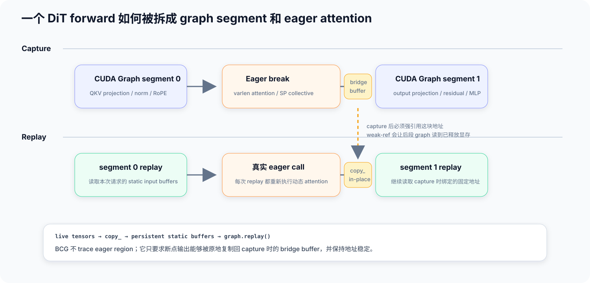
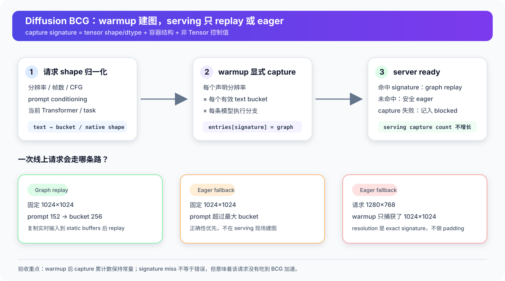
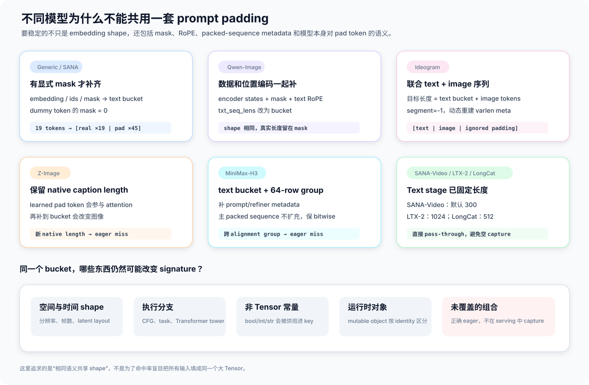

# SGLang Diffusion BCG 实现详解：模型 Padding、Graph Replay 与踩坑记录

# 0x0. 先说几句

Diffusion 的 denoising 就是把同一个 DiT forward 重复跑几十次。SANA、SANA-Video、Qwen-Image、Z-Image-Turbo 这类模型里短 kernel 特别多，CPU launch gap 能吃掉一大截时间。

SGLang 的 Breakable CUDA Graph（BCG）干的事情很直接：projection、normalization、RoPE、residual、MLP 这些稳定区域抓成 CUDA Graph segment；动态 attention、变长序列整理和一部分通信继续 Eager。

听起来不就是给 DiT 套一层 CUDA Graph？真费时间的不是套 graph，是搞清楚哪些 shape 能复用、复用完语义还不漂。

分辨率、视频帧数、CFG 分支、Transformer tower、任务类型都会改 capture signature。prompt 长度可以靠 bucket 少建几张图，但 SANA-Video、Qwen-Image、Ideogram、Z-Image、MiniMax-H3 的 padding 语义根本不是一回事。warmup 捕获了图，不代表 serving 一定在 replay；signature miss 会回退 Eager，图能出来，就是没加速。serving 阶段也不能临时建图，现在只在 warmup 建，server ready 之后要么 replay，要么 Eager。

正确性标准只有一个：和 Eager 等价。Z-Image 就因为一次“看起来合理”的额外 padding，画面肉眼可见地漂了；另一次 weak reference 优化更狠，replay 直接去读已经释放的显存。

写到 SGLang `main@96bfd2476c40bc575d87fd22c8508ece7c199614`，也就是 SANA-Video BCG 合进去的那个提交。文里 2026-08-21 那轮 H200 全量回归还是当时的 `main@dad6fd0f04556a9a2c09fc08388ecee45ed5a33f`；SANA-Video 用的是 [#35729](https://github.com/sgl-project/sglang/pull/35729) 合入前在 H200、B300 上单独跑的数据。

# 0x1. 为什么 Diffusion 适合 BCG

一次文生图或者文生视频，大致就是文本编码、准备 latent、denoising、VAE decode。里面最有规律的是 DiT 那段：scheduler 推一个 timestep，模型就跑一次结构几乎一样的 forward。

```text
prompt → text encoder → conditioning
                            │
noise / latent ─────────────┼─→ DiT(step 0)
                            ├─→ DiT(step 1)
                            ├─→ DiT(step 2)
                            │      ...
                            └─→ DiT(step N) → VAE decode
```

一个 step 里要是有两千个短 kernel，跑 20 步就是四万次左右 launch。GPU 真正算的时间可能没多少，CPU 一个个提交的空隙反而很显眼。SANA1.5 在 H200 上的 Eager profile 就是这样：单步大概两千个 kernel，GPU busy 只有 30% 左右。开 BCG 之后可以到 90% 以上。

所以 BCG 的边界也很清楚，它减的是 launch/dispatch，不是 FLOPs。小中分辨率、短 kernel 密、GPU timeline 上全是空洞，这时 BCG 往往很有用。1080p 视频已经 compute-bound 的时候，Eager 的 GPU busy 本来就接近 97%，replay 再快也省不了多少端到端时间。LTX-2 在 1920×1088×121 帧上就是这个结果，那种情况下 `torch.compile` 的 kernel fusion 反而更对口。

还有一点：BCG 抓的是 Eager kernel stream。SGLang 现在开了 BCG 就会跳过 `torch.compile`，免得把 Inductor 自己的 cudagraph tree 和 guard 再抓一遍。

# 0x2. Full CUDA Graph 为什么不够

整个 forward 都能 capture 当然最好，但 Diffusion 的 attention 经常不听话。

varlen attention 要根据这次的 prompt mask 重建 `cu_seqlens` 和 indices；Ulysses / Ring / TP collective 带着运行时通信状态；sparse 或者动态 attention backend 可能在 host 端生成 metadata；有些模型在 forward 里还会按任务、条件输入、sequence layout 选分支。

BCG 就留着这些动态区域。公共 DiT attention 入口包了一层 `@eager_on_graph`：capture 走到 attention 前先结束当前 graph，attention 正常 Eager 跑，然后再开一个新 segment。



模型这边看，forward 还是连续的。运行时这边已经变成：

```text
segment 0 → eager attention → segment 1 → eager attention → ... → segment N
```

Qwen-Image 一次 capture 大概几十个 segment，LTX-2 的双 tower 能到 289 个。后者还踩过一个很朴素的坑：早期 `SGLANG_DIFFUSION_BCG_MAX_SEGMENTS` 默认 128，图其实抓成功了，最后因为超上限被整份禁用。LTX-2 支持 PR [#33885](https://github.com/sgl-project/sglang/pull/33885) 把默认上限提到了 512。

# 0x3. 从一次请求到一次 replay

高层入口在 `DenoisingStage._bcg_run`，就做两件事：

```python
if self._bcg_is_warmup():
    for bucket in self._bcg_text_buckets():
        runner.capture(
            **self._bcg_pad_prompt_kwargs(
                call_kwargs,
                current_model=current_model,
                force_bucket=bucket,
            )
        )

return runner(
    **self._bcg_pad_prompt_kwargs(call_kwargs, current_model=current_model)
)
```

warmup 时显式把 text buckets 走一遍。正式请求再进 runner，只会查表和 replay；没有对应 entry 就直接调原始 Transformer。



## Capture signature 里有什么

Runner 会递归扫 kwargs。Tensor 只记 shape 和 dtype，值不进 key；tuple、list、dict 的结构会留着，dict 按 key 排序；简单的 Python 常量直接写进 signature；别的对象按类型和 identity 区分。

规则可以看成：

```python
Tensor   → ("tensor", shape, dtype)
int/bool/string/None → ("const", value)
list/tuple/dict      → 递归结构
mutable object       → (module, class, id(object))
```

有几个容易漏的后果。

两个 prompt 内容完全不同，只要 padding 后的 Tensor shape、dtype 和 kwargs 结构一样，就能共用一张图。实时 embedding 会在 replay 前 copy 到 persistent static buffer。

一个看着无害的 host integer 也可能造成 miss，因为它会被烤进 key。MiniMax-H3 的 `refined_prompt_embeds_length` 因此要在 BCG 输入副本里改成零维 Tensor，让长度变成每次 replay 能改的数据，而不是 Python 控制常量。

request-local 对象会按 identity 区分。把带着本次请求状态的对象整个塞进 kwargs，就算 Tensor shape 完全一样，下个请求也可能 miss。模型专用 padder 不只是补 Tensor，有时还得把这类临时字段删掉。

## Static input buffer

capture 前，Runner 给每个 Tensor leaf 分配持久 buffer。CPU Tensor 会先在 capture device 上建对应 buffer，免得 graph capture 里出现不合法的 host-to-device copy。然后在 capture stream 上先跑两次 warmup，把 cuBLAS、cuDNN、Triton/JIT workspace 准备好，再真正 capture。

replay 的核心路径很短：

```python
for buf, live in zip(entry.static_leaves, live_leaves):
    buf.copy_(live, non_blocking=True)

entry.graph.replay()
return clone(entry.output)
```

最后这一步 clone 不能随手删。captured output buffer 会被下一次 replay 盖掉；CFG 的正负分支还可能复用同一块 output。把 buffer 原样还给上层，很容易另一个分支跑完才发现前一个结果已经被改写。

## Eager 断点中间的 bridge buffer

Capture 到 attention 时，BCG 会结束前一个 segment，Eager 跑 attention，再用 attention output 的地址抓后一个 segment。这块 output 就是前后两段图之间的桥。

replay 时 attention 会产出一份新 output，但后一个 graph 只认识 capture 时的旧地址。所以要把新 output 原地 `copy_` 回 bridge buffer，再 replay 后一段图。

这块 buffer 的 lifetime 出过严重问题。最初 Diffusion BCG 合入后，bridge output 被转成 weak-ref tensor。Z-Image-Turbo replay 时，这块 graph 外分配的显存可能已经释放，后一个 segment 还握着旧地址，最后在 `cudaMemcpyAsync` 处 segfault 或者非法访存。[#30584](https://github.com/sgl-project/sglang/pull/30584) 把 eager break output 改回强引用，并加了 CUDA 回归测试。

两类引用不能混：

- graph segment 里产生的中间 tensor，有共享 mempool 和 segment graph lifetime 托着，可以弱引用，免得 Python reference 挡住显存复用
- eager break 的 output 在 graph 外分配，又是后一段图固定要读的地址，必须强引用

# 0x4. serving 为什么不能 capture-on-miss

初期也试过 capture-on-first-use：线上第一次碰到新 prompt length 或者新 shape，就临时建图。后来赶紧删了。

一次 diffusion capture 不是轻量 cache miss。它会多跑 warmup、同步设备、创建多个 CUDAGraph，还可能分配数 GB 常驻显存。把这些塞进用户请求，P99 会突然抬上去；多 rank 同时碰到新 signature，同步问题更难查。

现在的契约更简单：

1. warmup 阶段把声明过的分辨率和能覆盖的 prompt shape 都抓完
2. server ready 之后，命中就 replay
3. miss、capture failure、超限都走 Eager
4. serving 请求永远不增加 capture 数量

所以验证 BCG 时，不能只搜日志里有没有 `captured`。应该记：

```text
warmup capture count
→ request 1 后的 count
→ request 2 后的 count
→ ...
```

理想结果是 `[N, N, N, N, ...]`。每个请求到底是 replay 还是 Eager，还得看有没有 `serving signature MISSED`。最初的端到端 prompt-switch guard 是 [#30782](https://github.com/sgl-project/sglang/pull/30782) 加进 CI 的：同一个 server 先 warmup，再发两个不同 prompt，断言都返回图片，而且 capture log 数量没变。

# 0x5. 分辨率、帧数和 prompt bucket

BCG 不会把不同分辨率的 latent pad 到同一块大画布。`hidden_states` 的空间 shape 是 exact signature。`1024×1024` warmup 的图不能 replay `1280×768`；视频还要匹配帧数和时序 latent shape。没显式传 `--warmup-resolutions` 时，当前代码会自动抓模型默认 warmup 分辨率。生产服务会收多个尺寸的话，还是应该把常用尺寸写进 `--warmup-resolutions`，别的尺寸走 Eager。

Prompt 可以做 bucket。默认是：

```text
64, 128, 256, 512, 1024
```

也可以用 `--bcg-text-buckets` 覆盖。普通规则是选最小的 `bucket >= text_len`；超过最大 bucket 的 prompt 不 padding，warmup 没有对应 native signature，serving 直接 Eager。

但这只是普通规则。落到具体模型上，这套很快就不够用。

# 0x6. 各模型的 prompt padding



## SANA：通用 mask-aware padding

通用 padder 先从 `encoder_hidden_states` 或者 prompt mask 推断 text dimension。kwargs 里有显式 attention mask 才会继续，没有 mask 就原样返回。

要补齐的字段包括 embedding、text ids、position ids、attention mask、text RoPE cache，还有 `txt_seq_lens` 这类长度字段。新增位置默认补零，mask 也补零，dummy token 不进 attention。

SANA1.5 走这条路。它的 Gemma2 prompt embedding 是变长的，同时带 `encoder_attention_mask`。19-token 和 47-token 都可以补到 bucket 64：

```text
19 tokens: [real ×19 | masked pad ×45]
47 tokens: [real ×47 | masked pad ×17]
```

两次调用生成相同 signature，mask 和 embedding 内容还是各自请求的。SANA tokenizer cap 是 300，默认最大 bucket 1024 已经够用；常见请求落在 64、256 或者 512。

## SANA-Video：默认 300-token 直接复用

SANA-Video 虽然和 SANA1.5 同属一个家族，prompt shape 却不是同一种契约。它的 text stage 会在正向 prompt 前加一段比较长的增强指令，再保留 BOS 和末尾的 prompt window；默认 `max_sequence_length` 是 300。负向 prompt 也直接按 300 编码。所以默认配置下，两条 CFG 分支进 DiT 时已经是固定形状：

```text
encoder_hidden_states:    [1, 300, 2304]
encoder_attention_mask:   [1, 300]
```

要是让通用 padder 接手，300 会继续补到默认 bucket 512。mask 能保证结果还是对的，但每层 cross-attention 都得处理 212 个没用的位置，warmup 还会抓一组生产请求根本用不到的 512-token signature。

[#35729](https://github.com/sgl-project/sglang/pull/35729) 加了 SANA-Video 专用 pass-through padder。它同时看 Transformer 类型和 `encoder_hidden_states.shape[1] == 300`，满足默认契约就直接返回原 kwargs，不再遍历通用 buckets。这个 shape guard 很关键：用户要是显式改了 `max_sequence_length`，专用规则不会冒充默认路径，运行时还能回到通用 mask-aware padding。

默认 serving 只抓一个 `[1, 300, 2304]` DiT graph entry，不用设 `--bcg-text-buckets 300`：

```bash
python3 -m sglang.multimodal_gen.runtime.entrypoints.cli.main serve \
  --model-path Efficient-Large-Model/SANA-Video_2B_480p_diffusers \
  --enable-breakable-cuda-graph \
  --warmup-resolutions 832x480 \
  --enable-torch-compile false
```

## Qwen-Image：embedding、mask、RoPE 必须一起动

Qwen-Image 用专用 padder。只补 `encoder_hidden_states` 不够，因为 forward 还吃文本 RoPE cache 和 `txt_seq_lens`：

```python
encoder_hidden_states  # [B, text_seq, D]
encoder_hidden_states_mask
freqs_cis = (image_cache, text_cache)
txt_seq_lens
```

Padder 会同步做完这些事：`encoder_hidden_states` 和可选的第二组 text states 补到 bucket；没有 mask 时先建全 1 的真实区间，再把 padding tail 补成 0；只扩 `freqs_cis` 里的 text cache，不碰 image cache；把 `txt_seq_lens` 改成 bucket，让 host 常量也稳定。

真实长度由 mask 留着。Qwen attention 的 varlen metadata 不能直接把 warmup 时生成的 dict 一直复用，否则换 prompt 之后还是读旧的 `cu_seqlens` 和 indices。现在用 `DynamicVarlenMaskMeta`，每次 graph replay 的第一个 attention break 里重建一次 metadata，同一 replay 的后续 block 共用这份结果。

为此 Diffusion runner 还维护了一个递增的 replay token。cache key 不是“mask Tensor 地址”，而是“本次 replay token + mask shape”。Tensor 地址属于 static buffer，每次 replay 都一样，只按地址缓存正好会拿到陈旧 metadata。

## Ideogram-4：padding 的是 text-image 联合序列

Ideogram 把 text token 和 image token 放在同一条序列里。真实文本长度 `T`，image token 数 `I`，目标 text bucket `B`，capture 输入的总长度是：

```text
target_total = B + I
```

Padder 会同步扩 `llm_features`、`x`、`position_ids`、`segment_ids`、`indicator` 和 attention mask。新增行的 `segment_id` 设成 `-1`，mask 为 false。`attn_mask_meta` 换成前面说的 `DynamicVarlenMaskMeta`，保证不同真实 prompt 重放同一张图时，varlen attention 还按当前 mask 重建。

这里不能只看总长度相等。`llm_features` 补了，`position_ids` 或者 segment metadata 没补，轻则 signature miss，重则前后 graph segment 对同一行的语义理解不一样。

## Z-Image：正确做法是别用通用 text bucket

Z-Image 是这套实现里最值得记住的反例。

最初的想法和 Qwen 一样：不同 caption length 补到共同 bucket，再用 mask 隔开。Crash 修好之后，BCG 输出和 Eager 的 PSNR 只有 21.24 dB，画面肉眼可见地漂。定位到第一处差异时，问题在 `context_refiner.0`，也就是第一个 caption self-attention。

原因是 Z-Image 的原生 caption 已经按 32 的倍数 padding，但这些 learned pad-token embedding 不是无效占位，它们会作为 attended registers 参与 attention。把 native length 继续补到 64、128，等于真的增加了模型可以关注的 register 数量。mask 救不回来，因为自然路径本来就是 unmasked。

[#34210](https://github.com/sgl-project/sglang/pull/34210) 最后选择保留 incoming native caption length：

```python
bucket = max(seq, cap_freq_len)
```

这里的 `bucket` 实际已经不来自 `--bcg-text-buckets`。相同 native length 还能共享图，不同 native length 就故意用不同 signature；serving 碰到 warmup 没抓过的长度就 Eager。命中率少一点，输出是 bit-exact 的。

padding 是模型语义的一部分，不是纯粹的 shape 工程。Z-Image 把这件事钉死了。

## MiniMax-H3：text bucket 之外还有 64-row alignment group

MiniMax-H3 把 text、video/image 和 audio row 放进 packed sequence。Padder 会把 `prompt_embeds` 补到 text bucket；给 dummy text row 生成不会进真实计算的 position id；把 `refined_prompt_embeds_length` 从 host integer 改成 scalar Tensor；删掉 request-local `local_embedding_layout`；重建 main/refiner 两套 `PackedSeqParams`。

但它明确不扩主 packed sequence `x`。不是实现困难，是数值约束：改主序列长度会改 sequence-parallel row partition 和 GEMM shape，就算 padding row 属于独立 attention segment，最后也保不住 bitwise Eager 等价。

所以 H3 的可复用范围是：同一个 text bucket，并且主 packed sequence 落在同一个 64-row alignment group。跨 group 的请求会 signature miss，走 Eager。Ref2VA 这类条件序列很长的任务，cookbook 用了 `--bcg-text-buckets 5504`，别假设默认 1024 对所有 H3 task 都够用。

## LTX-2 / LTX-2.3：文本编码阶段已经固定到 1024

LTX-2 tokenizer 用的是：

```python
padding="max_length"
max_length=1024
truncation=True
```

短 prompt 和接近上限的长 prompt 进 DiT 时都是 `(1, 1024, D)`。BCG 不用再做 text bucketing。真实 serving 测试里，5、33、126、702 words 的 prompt 都复用同一组 graph，没有 signature miss。

LTX-2 的难点在别处：视频帧数、可选 conditioning image、双 tower、CFG parallel，还有 forward 里的 RoPE coordinate 构造。后面坑的部分会单独讲。

## LongCat-Image：固定 512，专用 pass-through

LongCat 会把 prompt body truncate/pad 到固定 512，并且这 512 个位置全部作为 DiT conditioning。默认通用 padder 要是再遍历 64/128/256/512/1024 buckets，会生成一堆没用的扩展 signature。

[#35724](https://github.com/sgl-project/sglang/pull/35724) 因此加了一个很小的 model-specific pass-through padder：认出 LongCat 就直接留现有 kwargs。不管原始 prompt 有没有经过 rewrite，DiT 看到的 text shape 都是固定 512。

## GLM-Image：自然语言和 glyph 是两条路

GLM-Image 的自然语言主要先经过 sampled AR prior，DiT 接收的 prior token shape 由分辨率决定，所以普通 prompt 长度变化不会直接改主要 DiT signature。引号里的文字会另外抽成 glyph embeddings，这部分长度可以变。

现在 GLM 没有独立的 prompt padder。没有引号的短、中、长 prompt 在 serving 回归里都复用了同一张图；带不同长度 quoted text 的路径还值得补一组专门测试。要是证实有 miss，应该围着 glyph mask 设计 padder，别把整个 GLM prompt 当成普通 text conditioning。

# 0x7. 支持列表其实有两道 gate

用户传了 `--enable-breakable-cuda-graph`，不是 model ID 在 allowlist 里就完事了。当前代码同时看：

```text
normalized model_id / model_path 命中 allowlist
                    AND
pipeline config class 命中 allowlist
```

这么做是因为相同 repo basename 可能走不同 loader 或者 pipeline config，只按字符串放行很容易把没验证过的变体带进 BCG。

SANA-Video 合入时把这件事做齐了：[#35729](https://github.com/sgl-project/sglang/pull/35729) 同时登记完整 model ID、basename 和 `SanaVideoPipelineConfig`，再注册 300-token padder。少任何一项，结果都是“代码已经写了，线上 gate 没开”，或者“BCG 开了，却抓了错误的 shape”。

双 gate 也留了一个真实缺口。`fal/ideogram-v4-fast` 和 `fal/ideogram-v4-instant` 已经在 model-ID allowlist，实际解析出来的却是 `Ideogram4DistilledPipelineConfig`；pipeline-config allowlist 只有 `Ideogram4PipelineConfig`。日志会写成：

```text
[Diffusion BCG] disabled for Ideogram4DistilledPipelineConfig ...
```

现有单元测试分别断言了 fal model IDs 和普通 Ideogram config 存在，却没验证“每个 model ID 经过 registry 解析后，两道 gate 能同时过”。所以测试是绿的，功能还是关着的。

BCG 的有效支持矩阵应该来自 registry resolution，不是两张集合各自的成员测试。这个问题适合单独修一个 PR：加入 distilled pipeline config 之前，先确认它还走 Ideogram padder，并用 Fast/Instant 的真实 server warmup 和 prompt switch 做回归。

# 0x8. 初期踩过的坑

Diffusion BCG 的首个 PR [#27436](https://github.com/sgl-project/sglang/pull/27436) 最后有 86 个 commit。不是为了堆功能，是因为不少失败方式看着都挺正常：服务不崩、图片能返回、日志甚至出现过 capture，但请求可能已经悄悄回到 Eager，或者图像在数值上已经变了。

## 先做大 allowlist，再不断缩回去

初版分支试过 SANA、Cosmos、Wan、Helios、LTX、Hunyuan3D、MOVA、GLM、FLUX2 Klein 更宽的范围。随后提交历史里出现了：

```text
Restrict diffusion BCG support
Limit diffusion BCG to Qwen Image models
Remove FLUX2 Klein from diffusion BCG allowlist
Disable GLM Image diffusion BCG support
Restore GLM Image BCG support
Add Ideogram diffusion BCG support
Revert ...
Revert the revert ...
```

能 capture 某个 forward，不等于这个模型已经能发。一个模型要进 allowlist，至少得过这几关：capture 发生且成功，不是异常后 Eager fallback；serving 的真实 signature 打中 warmup graph；不同 prompt、同 seed 的 Eager/BCG 输出满足该 pipeline 的 lossless contract；TP、CFG、task variant、frame/resolution 这些已经声明的支持范围，没有偷偷走另一条没验证过的分支。

最终初始 PR 只留了 Qwen-Image、Z-Image、GLM-Image 和 Ideogram-4 几个逐项验证过的家族。SANA、LTX-2 是后面的 PR 重新打开的。

## Warmup 请求和真实请求不是同一个 shape

“已经 warmup”很容易给人错误安全感。LTX-2 在 [#33885](https://github.com/sgl-project/sglang/pull/33885) 里一次暴露了两个 warmup shape 问题。

一个是通用视频 warmup 为了省时间会把帧数限制到 17，真实请求是 121 帧。BCG 只认 exact latent shape，17 帧 graph 对 serving 完全没用。

另一个是通用 warmup 会构造一张 synthetic image。LTX-2 是 optional TI2V pipeline，有图时会切到 image-conditioned 分支，`denoise_mask` 和 timestep shape 都跟纯 T2V 不一样。结果 warmup 抓的是 TI2V signature，生产 T2V 请求全部 silent miss。

后来的原则很简单：BCG warmup 不能用为了快速启动而缩小的替代 workload。它必须忠实复现要服务的帧数、conditioning variant、CFG 模式和 resolution。TI2V 没有对应 warmup，宁可明确 Eager。

## 模型可能绕过通用 DenoisingStage hook

通用 pipeline 会在 `predict_noise` 里经过 `_bcg_run`，但 LTX-2 自己组织 two-stage denoise，并且直接调用 `step.current_model(...)`。allowlist 加好了，Runner 也能用，实际 model call 却绕开了 hook。

这种问题看代码其实能看出来，实际跑起来却很像“BCG 对这个模型收益为零”。修的时候要顺着每个 pipeline 的真实 call graph 查，不能只搜 Transformer class 在不在。

## Capture 区域内不能偷偷创建 CUDA Tensor

LTX-2 和 LTX-2.3 的 legacy path 曾经在 model forward 里执行：

```python
torch.tensor(host_list, device="cuda")
```

这会在 capture 内触发 unpinned host-to-device copy，CUDA Graph 不允许。解决办法不是把错误吞掉，而是用完全相同的 RoPE helper 在进 BCG 前准备 coordinate Tensor，再作为静态输入传进去。LTX-2.3 的支持见 [#34929](https://github.com/sgl-project/sglang/pull/34929)。

Runner 只能兜住已经是 kwargs leaf 的 CPU Tensor，把它预先搬到 capture device；model forward 深处临时创建的 host data，它修不了。

## 动态 metadata 不能按 static buffer 地址缓存

Graph replay 的 static mask buffer 地址一直不变，内容每次都会更新。attention metadata cache 要是只看 `data_ptr()` 和 shape，换 prompt 之后还是 warmup 的 `cu_seqlens`。

Qwen/Ideogram 的 `DynamicVarlenMaskMeta` 用 replay token 解决了这件事。一次 replay 的第一个 attention block 按当前 mask 重建 metadata，后面几十层复用；下一次 replay token 变了，再重新算。

这是一类很常见的 CUDA Graph bug：地址稳定本来是 replay 的前提，却会让传统“按地址缓存”的逻辑错误地以为数据也没变。

## Z-Image 的两类悬空地址

Z-Image 先后碰到两种 lifetime 问题。

第一种就是前面说的 eager bridge output weak-ref，影响通用 BCG core，[#30584](https://github.com/sgl-project/sglang/pull/30584) 修了。

第二种来自 Z-Image 自己的单槽 cache：RoPE、attention metadata 和 batched frequency cache 都按 `(cache_key, value)` 只存一份。连续 capture 多个 text bucket 时，新 bucket 会替换旧 slot 并释放 tensor，但旧 graph 已经把旧 tensor 的 device address 烤进节点。第一次 replay 就会读已释放地址。

[#34210](https://github.com/sgl-project/sglang/pull/34210) 在 active capture 期间 pin 住这些 cache value。增长规模跟 cache site × captured signatures 成正比，而且只 pin 很小的 metadata tensor。

这个 bug 在 TP=2 nightly 没暴露，因为 per-layer NCCL 同步掩盖了 allocator race；`compute-sanitizer` 的串行化也会让问题消失。最后是单 GPU、逐 segment 同步、单 bucket/双 bucket 对照才定位出来。调 CUDA Graph 时，工具一改时序“问题消失”，不等于内存安全。

## SANA 被一个没人读取的 Python 参数拖慢

SANA 初次打开 BCG 时，`predict_noise` 每次 forward 都构造一个 72,000 元素的 nested `None` list，当成 `mask_strategy` 传给 DiT。仓库里的 DiT 没有任何实现读它，很多模型只是用 `**kwargs` 悄悄吞掉。

Eager 下构造这份 list 每次大概 1.1 ms。到了 BCG，Runner 为了生成 signature 还要递归遍历全部 72,000 个 leaf。结果图能 replay，BCG denoise 却从 0.67 s 变成 2.63 s，比 Eager 更慢。

[#33989](https://github.com/sgl-project/sglang/pull/33989) 删了这份 dead payload。SANA 在 H200 1024² 上的 denoise 随后从 699.2 ms 降到 408.1 ms，端到端从 0.821 s 降到 0.608 s。

Signature 设计要管的不只是 graph 数量，也包括每次查 key 的 CPU 成本。别把大而无用的 Python 容器传进 model forward。

## 正确性对比必须冻结随机前置阶段

GLM-Image 在 DiT denoise 前还有 sampled AR prior，用的是 `do_sample=True`。Eager 和 BCG 两次进程分别采样 prior，就算 DiT 完全一致，最终图片也可能不同。

初始 PR 后来给 AR prior 接上 request seed，并且额外做了 same-prior replay：先存 BCG 请求采样的 prior，再把完全相同的 prior 喂给 Eager。这次对比拿到了 exact pixel match。

所以 Diffusion correctness 不能机械地“同 prompt、同 seed、两张图片相减”。先确认所有随机阶段都被同一个 seed 控制；pipeline 里有 sampled prior、prompt rewrite 或者随机 conditioning，就保存中间结果做分段对比。

## Benchmark flag 的默认语义会变

最初 PR 用 `--performance-mode speed` 做 BCG/Eager 对比。后来 [#30016](https://github.com/sgl-project/sglang/pull/30016) 改了 speed preset，让它默认开 `torch.compile`。直接重跑旧命令，所谓 Eager arm 已经不是同一条执行路径。

后面回归统一显式指定：

```text
--enable-torch-compile false
--dit-layerwise-offload false
--dit-cpu-offload false
```

并且检查日志没有 diffusers fallback。性能回归要是不冻结 preset 展开后的真实参数，很容易把配置变化误判成 BCG regression。

## Cache-DiT 和 BCG 不能同时工作

Cache-DiT 会给 Transformer forward 包一层随 timestep 改变的 step-skipping control flow。把这段逻辑烤进静态 graph 会得到错误路径，所以开 BCG 时 Cache-DiT 会被关掉。[#34242](https://github.com/sgl-project/sglang/pull/34242) 补了明确 warning，避免 `quality=high` 或者环境变量请求了 Cache-DiT，实际却静默失效。

# 0x9. 性能数据

## 初始 B200 结果

[#27436](https://github.com/sgl-project/sglang/pull/27436) 的 B200 结果如下。这里是 warmup 后的非 profile denoise latency。不同模型的 graph 数量不能直接横比，一次 graph entry 里的 segment 数不同，CFG 和多 tower 也会增加 entry。

| 模型 / shape | capture 数 warmup→req1→req2 | Eager denoise | BCG denoise | 加速 |
| --- | ---: | ---: | ---: | ---: |
| Qwen/Qwen-Image 512² | `5→5→5` | 6.48 s | 2.45 s | 2.64× |
| Qwen/Qwen-Image-2512 512² | `5→5→5` | 6.21 s | 2.44 s | 2.55× |
| Tongyi-MAI/Z-Image 256² | `5→5→5` | 1.205 s | 0.634 s | 1.90× |
| Tongyi-MAI/Z-Image-Turbo 512² | `5→5→5` | 0.113 s | 0.026 s | 4.26× |
| zai-org/GLM-Image 512² | `1→1→1` | 1.100 s | 0.878 s | 1.25× |
| Comfy-Org/Ideogram-4 512² | `6→6→6` | 1.564 s | 0.916 s | 1.71× |

Z-Image 在 [#34210](https://github.com/sgl-project/sglang/pull/34210) 之后改成按 native caption length 捕获，所以今天默认 warmup 通常只得到 1 个 graph，不是表里的 5 个。这是为了 bit-exact 主动收紧复用范围，不是性能退化。

下面是初始 PR 里 Qwen-Image 的同 prompt、同 seed Eager/BCG serving 输出：

<table>
<tr>
<td width="50%"><b>Eager</b><br></td>
<td width="50%"><b>BCG</b><br></td>
</tr>
</table>

图像“看起来差不多”只能当第一层检查。Lossless 路径最后应该比 PNG bytes、pixel diff 或者视频 md5；模型本身有不稳定阶段，再分段冻结输入。

## SANA 和 LTX-2 的 profile：BCG 到底省掉了什么

SANA1.5 的 H200 serving profile 很直观。Eager 的 GPU busy 大约 28.5%，5 个 profiled timesteps 里有 8,412 次 runtime launch；BCG 的 GPU busy 到 93.3%，runtime launch 降到 132 次。


LTX-2 768×512×121、2×H200 CFG parallel 的变化类似：GPU busy 从 27.9% 到 96.2%，runtime launches 从 21,918 降到 4,854。BCG 并没有消灭 attention 和 communication，它把两者之间的大量小算子合并成 segment replay。


但 1920×1088 下 Eager GPU busy 已经有 96.8%，BCG 只有大约 0.2% 的端到端差异。这类 workload 应该把力气放在 GEMM、attention 和 fusion 上，而不是继续堆 graph 覆盖率。

SANA 后来还说明 BCG 和 kernel fusion 不冲突。[#34928](https://github.com/sgl-project/sglang/pull/34928) 把 convolution 后的 bias+SiLU、bias+GLU 和 residual gate/add 做成 bit-exact kernel，并在 BCG 里捕获这些新 kernel。B300 上 denoise 从 BCG 优化前大约 0.333 s 降到 0.233 s，比同配置 `torch.compile` 的 0.272 s 还低。BCG 解决 launch gap，kernel fusion 减少真实 GPU work，两件事不在一层。

## SANA-Video 合入后的 H200 / B300 结果

[#35729](https://github.com/sgl-project/sglang/pull/35729) 在 H200 上先跑了一个 832×480、81 帧、8 steps 的短回归。两次 Eager 和 BCG denoise：

| 路径 | Denoise latency | Peak reserved |
| --- | ---: | ---: |
| Eager | 920.6 / 925.3 ms/step | 约 21.44 GB |
| BCG | 797.8 / 798.9 ms/step | 约 24.80 GB |

平均每步从 923.0 ms 降到 798.4 ms，少大约 13.5%，代价是大约 3.4 GB 额外 reserved memory。默认 `bcg_text_buckets=None` 的最终验证只抓了一个 `[1, 300, 2304]` graph entry，没有通用 bucket warning，生成 MP4 的 SHA256 和 Eager 完全相同。H200 上默认 81 帧、50 steps 的 server warmup 大约 52.8 秒，这是一次性建图成本，不计入稳态 denoise。

B300 又按 cookbook 的 production prompt 跑了 50 steps、`quality=lossless` 的完整视频：

> A red tram moves slowly through a sunlit city square while pedestrians cross behind it. motion score: 30.


[并排视频](https://raw.githubusercontent.com/BBuf/sglang/pr-media/diffusion-prs/35729/side-by-side.mp4) · [Eager 视频](https://raw.githubusercontent.com/BBuf/sglang/pr-media/diffusion-prs/35729/main.mp4) · [BCG 视频](https://raw.githubusercontent.com/BBuf/sglang/pr-media/diffusion-prs/35729/pr.mp4)

测试配置是 B300 SXM6、单卡 BF16、832×480、81 帧、16 FPS、50 steps、guidance 6.0、seed 42、原生 SGLang backend：

| 路径 | 三次 saved-request e2e | 平均 e2e | 平均 denoise stage | 平均 decode stage |
| --- | --- | ---: | ---: | ---: |
| main，Eager | 53.399 / 53.401 / 53.417 s | 53.405 s | 50.711 s | 2.154 s |
| PR，BCG | 53.062 / 53.059 / 53.071 s | 53.064 s | 41.578 s | 10.939 s |

Denoise stage 缩短了 18.01%，但保存请求的真实端到端只缩短 0.64%。BCG 路径里的异步工作改了 stage logger 的同步归属，一部分时间被记到了 decode，所以不能拿 18.01% 直接代替 e2e。这里以 saved-request wall clock 为端到端口径，覆盖 text encoding、DiT、VAE decode、结果 materialize 和视频保存；55.05 秒的一次性 capture 和一次 benchmark warmup 都排除在外。

两条 MP4 最终 byte-exact，SHA256 都是 `e16b7beef1f4c74a6246d79407999329d8092e5d5774261449d2a2e5a72839a1`。模型组测试结束后删了 14,003,439,075 bytes、5 个权重文件，并确认隔离 cache 里没有残留模型权重。

## 2026-08-21 H200 全量 serving 回归

为了确认当前支持矩阵，我在 H200 上对每个已列出的模型仓库/变体启动了真实 SGLang server。每个模型固定 resolution，依次发四档 prompt：5、32、132、726 words。记录 warmup 后和每次请求后的累计 capture log 数，同时看 signature miss、capture failure、diffusers fallback 和 HTTP/output。

测试基线是 `main@dad6fd0f04556a9a2c09fc08388ecee45ed5a33f`。这张矩阵早于 #35729 合入，所以不含 SANA-Video；它的独立验证数据见上一节。

| 模型 | 固定 workload | capture 计数：warmup + 4 requests | miss | 结论 |
| --- | --- | ---: | ---: | --- |
| SANA1.5 | 1024×1024 | `[5,5,5,5,5]` | 0 | 五个 text buckets 全部稳定 replay |
| Z-Image-Turbo | 512×512 | `[1,1,1,1,1]` | 1 | native caption length 未覆盖时 Eager，无 recapture |
| Z-Image | 256×256 | `[1,1,1,1,1]` | 1 | 同上 |
| Qwen-Image | 512×512 | `[5,5,5,5,5]` | 0 | 通过 |
| Qwen-Image-2512 | 512×512 | `[5,5,5,5,5]` | 0 | 通过 |
| GLM-Image | 512×512 | `[1,1,1,1,1]` | 0 | 普通、无 quoted glyph prompt 通过 |
| LongCat-Image | 1024×1024 | `[1,1,1,1,1]` | 0 | 固定 512-token conditioning |
| Ideogram-4 FP8 | 512×512 | `[6,6,6,6,6]` | 0 | 通过 |
| Ideogram-4 NF4 | 512×512 | `[6,6,6,6,6]` | 0 | 通过 |
| LTX-2 two-stage | 768×512×121，2×H200 CFG parallel | `[3,3,3,3,3]` | 0 | 3 entries，每个含 289 segments |
| LTX-2.3 one-stage | 768×512×121 | `[1,1,1,1,1]` | 0 | 1 entry，289 segments |
| MiniMax-H3 T2VA | 1344×768，TP2 | `[4,4,4,4,4]` | 2 | 两个 64-row group miss，按设计 Eager |
| fal Ideogram Fast | 512×512 | `[0,0,0,0,0]` | — | server/output 正常，distilled config gate 缺失 |
| fal Ideogram Instant | 512×512 | `[0,0,0,0,0]` | — | 同上 |
| Comfy-Org/Ideogram-4 | 512×512 | 加载阶段失败 | — | NVFP4 需要 CC 10.0+，H200 是 CC 9.0 |

15 个模型仓库/变体里，12 个完成了真实 BCG serving 回归；2 个 fal distilled Ideogram 被 gate bug 关掉，1 个 NVFP4 checkpoint 因为 H200 架构不支持，在加载阶段退出。

这组结果里，Z-Image 和 H3 的 miss 是正确性策略的一部分：它们宁愿 Eager，也不跨不安全的 padding/alignment 边界共享图。fal Fast/Instant 则是实际支持 gate bug。这两类不要混在一起统计成一个笼统的“BCG miss rate”。

MiniMax-H3 用 TP2，是因为测试时可用 H200 只剩两张。四条 capture log 对应两个 signature × 两个 TP rank；每个 signature 有 52 个 segment。短 prompt 之后每个 rank 出现一次 packed-sequence alignment miss，中长 prompt 没有继续增加 miss，累计 capture 数始终是 4。

### 测完模型后清理权重

这轮测试给每个模型分配独立的 `HF_HOME`、Hub cache、SGLang cache 和 output 目录。一个模型结束后先停 server，再删该模型的隔离 cache，最后检查权重后缀有没有残留。

全量结束后，对 runs tree 再做一次总审计：

```text
残留 .safetensors/.bin/.pt/.pth/.gguf：0
残留 hf/sgl_diffusion/torch/output cache 目录：0
报告和 server log 总大小：约 1.2 MB
```

LTX-2、LTX-2.3 和 MiniMax-H3 的 snapshot 带着大量 hardlink，按文件逻辑大小统计能到数百 GB。不做逐模型清理，长矩阵跑到一半很容易把磁盘写满。

# 0xA. 怎么判断真的命中了

以 SANA1.5 为例：

```bash
python3 -m sglang.multimodal_gen.runtime.entrypoints.cli.main serve \
  --model-path Efficient-Large-Model/SANA1.5_1.6B_1024px_diffusers \
  --num-gpus 1 \
  --host 127.0.0.1 \
  --port 30000 \
  --enable-breakable-cuda-graph \
  --warmup-resolutions 1024x1024 \
  --bcg-text-buckets 64 128 256 512 1024
```

如果只服务模型默认尺寸，可以省略 `--warmup-resolutions`，当前实现会自动补一个默认 warmup resolution。生产服务还是建议把常用尺寸写清楚。

启动日志要看到：

```text
[Diffusion BCG] captured ... segment(s) ... for signature ...
```

收到请求后重点搜：

```text
[Diffusion BCG] serving signature MISSED ...
[Diffusion BCG] capture failed ...
Falling back to diffusers backend
```

只看请求 latency 不够。Eager fallback 往往完全正确、也不报错，尤其模型本来就 compute-bound 时，几秒的数字很难凭肉眼判断是不是 replay。

一次完整检查我一般会这样记：

```text
1. 等待 server ready，记录 capture_count_0
2. 请求短 prompt，记录 capture_count_1
3. 请求中 prompt，记录 capture_count_2
4. 请求长 prompt，记录 capture_count_3
5. 请求接近 tokenizer cap 的 prompt，记录 capture_count_4
6. 断言所有 count 相等
7. 分别统计 signature miss、capture failure、fallback
8. 与 Eager arm 做同 seed 的像素/md5 对比
```

# 0xB. 给新模型加 BCG 时我会先看什么

先把 shape contract 搞清楚。DiT 收到的 text conditioning 是变长、固定长度，还是原生量化长度？padding token 是不是真的被 mask，模型会不会把 learned pad token 当成有效 register？分辨率、帧数、CFG、task、reference media 会改哪些 kwargs？pipeline 是走通用 `DenoisingStage`，还是自己直接调 Transformer？有没有 `transformer_2` 或者 two-stage tower，要不要给每个 module 存独立 runner？

再审 capture 区域。attention、collective、dynamic packing 放到合理的 Eager break；forward 里没有 `.item()` 驱动 Python control flow，也没有 capture 内临时 H2D copy；cache tensor 在 graph lifetime 内地址稳定；Eager break output 有强引用；replay-local metadata 不按 static buffer 地址错误复用；非 Tensor kwargs 里没有 request-local object 或者巨型无效容器。

测试不能只写 unit test。Unit test 至少验证：两个应共享 bucket 的 prompt 得到相同 `_signature_kwargs`；mask 的真实区间和 padding 区间正确；RoPE、length metadata、packed-sequence metadata 同步更新；不该共享的 native length/alignment group 保持不同 signature；model ID 经过 registry 解析后能同时过 model 和 pipeline 两道 gate。

GPU 测试还得起真实 server。最小矩阵覆盖短、中、长、近上限 prompt；记录 warmup/每次请求后的 capture count；检查没有 diffusers fallback；至少存一组 Eager/BCG 输出。视频模型还要覆盖 frame count、CFG parallel 和 task variant。

# 0xC. 还没做完的事

fal Ideogram Fast/Instant 的 effective allowlist 还没修。PR 不该只加一个字符串，还得确认 distilled Transformer 能打中 Ideogram padder，并补 registry-resolution gate test 和真实 serving prompt-switch case。

MiniMax-H3 的 warmup coverage 也偏窄。现在 synthetic warmup 只能覆盖部分 64-row packed-sequence group，没命中的线上请求虽然正确，却吃不到加速。可以按 task profile 预热几个代表性的 aligned group，但不能靠扩充主 packed sequence 强行合并，那会破坏 bitwise Eager 等价。这里还要盯着 graph 显存。

GLM quoted glyph prompt matrix 也缺。先验证不同引号文本长度会不会 miss，再决定要不要 glyph-specific padder 和 mask；没有数据之前别直接扩大 padding。

`Comfy-Org/Ideogram-4` 可以更早做硬件兼容检查。NVFP4 checkpoint 在 H200 上注定加载不了，当前错误信息是清楚的，但已经下载大量组件之后才失败，挺浪费磁盘和时间。可以在解析 quant config 后、下载完整权重前 fail fast，并在 compatibility matrix 标明 Blackwell-only。

文档和 Diffusion skills 也得跟着支持矩阵走。#35729 已经把 SANA-Video 的 BCG 用法和性能结果补进 CLI 文档、benchmark/profile skill 和 performance skill；后面每个模型 PR 最好也一起改，别只合代码。至少长期记着这些事：有效支持条件是 model ID 和 pipeline config 双 gate；warmup 后 capture count 必须保持常量；Z-Image native-length miss 和 H3 alignment miss 是有意设计；SANA-Video 默认固定 300 token，不该扩到通用 512 bucket；BCG 会禁用 `torch.compile` 和 Cache-DiT；H200 加载不了 NVFP4 Ideogram；全模型验证必须用逐模型隔离 cache，每个模型结束后删权重。

Diffusion BCG 的主要代码其实不长：一个 diffusion runner、一套 prompt-padding registry，再加公共 attention 上的 Eager break。耗时间的是给每个模型找出“哪些 shape 可以共享，而且共享后语义完全不变”。

Qwen 可以靠 mask 和 RoPE 同步 padding；Ideogram 要处理 text-image 联合序列；Z-Image 不能额外 padding；MiniMax-H3 还受 packed-sequence alignment 限制；SANA-Video、LTX-2 和 LongCat 则在 text stage 已经拿到固定长度。把它们统一成一个“全部补到 1024”的实现会更短，也一定会出错。

warmup 尽量覆盖已知 shape，serving 只 replay 已验证的 graph，任何不确定组合都回 Eager。命中率会少一点，但这套东西才能在长期跑的 Diffusion server 里用，而不是只在单条 benchmark 命令里好看。

# 参考资料

- [SGLang 中的 CUDA Graph 进阶指南](./SGLang%20中的%20CUDA%20Graph%20进阶指南.md)
- [#27436：首次为 Diffusion DiT 引入 BCG](https://github.com/sgl-project/sglang/pull/27436)
- [#30584：修复 Eager bridge buffer lifetime，并加入真实 GPU CI](https://github.com/sgl-project/sglang/pull/30584)
- [#30782：加入 serving prompt-switch graph reuse guard](https://github.com/sgl-project/sglang/pull/30782)
- [#33275：MiniMax-H3 原生支持及其 packed-sequence BCG padder](https://github.com/sgl-project/sglang/pull/33275)
- [#33421：修复 Diffusion BCG tensor parallel capture](https://github.com/sgl-project/sglang/pull/33421)
- [#33885：LTX-2 BCG 支持与 H200 profile](https://github.com/sgl-project/sglang/pull/33885)
- [#33989：SANA BCG 支持及 dead signature payload 修复](https://github.com/sgl-project/sglang/pull/33989)
- [#34174：未声明 resolution 时自动捕获模型默认尺寸](https://github.com/sgl-project/sglang/pull/34174)
- [#34210：Z-Image replay crash 与 bit-exact padding 修复](https://github.com/sgl-project/sglang/pull/34210)
- [#34242：BCG 禁用 Cache-DiT 时输出明确 warning](https://github.com/sgl-project/sglang/pull/34242)
- [#34928：在 SANA BCG 中加入 bit-exact fused kernels](https://github.com/sgl-project/sglang/pull/34928)
- [#34929：LTX-2.3 BCG 支持](https://github.com/sgl-project/sglang/pull/34929)
- [#35724：LongCat 固定 512-token BCG 路径](https://github.com/sgl-project/sglang/pull/35724)
- [#35729：SANA-Video 固定 300-token BCG 路径与 H200/B300 验证](https://github.com/sgl-project/sglang/pull/35729)
- [Diffusion BCG runner 源码](https://github.com/sgl-project/sglang/blob/96bfd2476c40bc575d87fd22c8508ece7c199614/python/sglang/multimodal_gen/runtime/breakable_cuda_graph/runner.py)
- [Prompt padding 与 model-specific padder](https://github.com/sgl-project/sglang/tree/96bfd2476c40bc575d87fd22c8508ece7c199614/python/sglang/multimodal_gen/runtime/breakable_cuda_graph)
